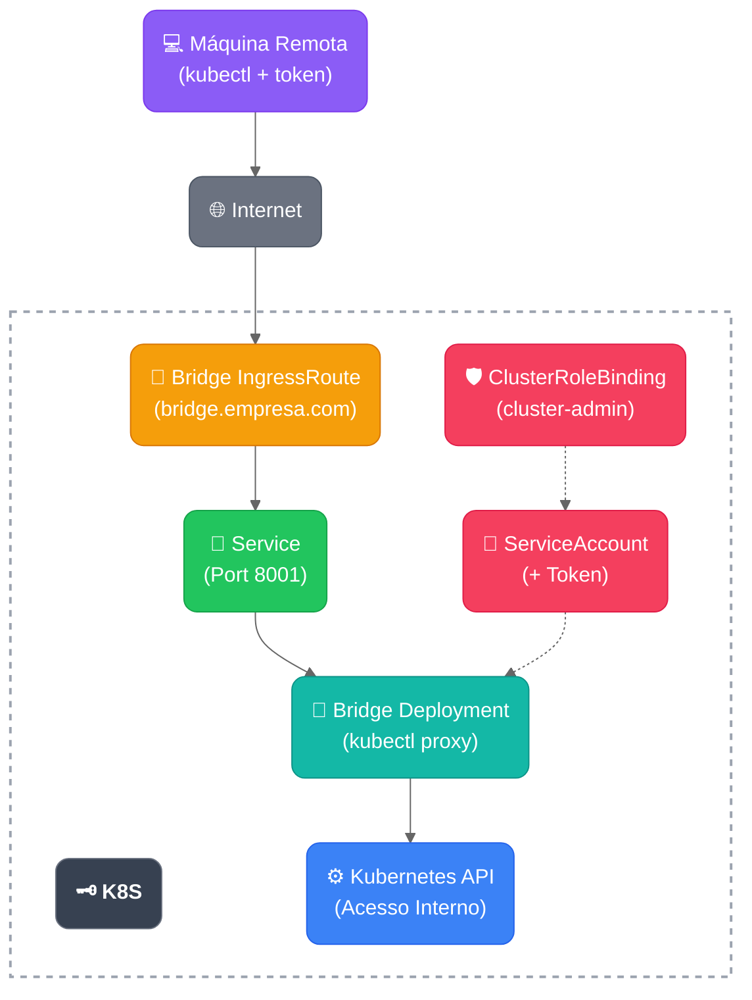

# 🌉 Bridge Helm Chart

## 📋 **Descrição**

Chart Helm simplificado para deploys do **Bridge** - ponte que permite **acesso remoto** ao cluster Kubernetes via token (sem necessidade de certificados). 

### **🎯 Como Funciona**
1. **Bridge é instalado no cluster** (ou numa máquina com acesso ao cluster)
2. **Máquinas remotas** configuram kubectl para usar o Bridge como proxy
3. **Acesso seguro** via token em vez de certificados complexos

**Cenário típico**: Você tem um cluster Kubernetes e quer que desenvolvedores/máquinas remotas acessem sem precisar configurar certificados ou VPN.

## 🎯 **Casos de Uso Práticos**

### **👨‍💻 Desenvolvedor Remoto**
- **Problema**: Desenvolvedor em casa quer acessar cluster da empresa
- **Solução**: Bridge instalado no cluster, desenvolvedor configura kubectl com token
- **Resultado**: Acesso seguro sem VPN ou certificados complexos

### **🏢 Equipe Distribuída**
- **Problema**: Múltiplas máquinas/desenvolvedores precisam acessar o cluster
- **Solução**: Um bridge, múltiplos tokens (ou token compartilhado)
- **Resultado**: Acesso centralizado e controlado

### **🔧 CI/CD Pipeline**
- **Problema**: Pipeline precisa executar kubectl em ambiente externo
- **Solução**: Bridge como proxy, token no CI/CD
- **Resultado**: Deploy automatizado sem expor certificados

### **🧪 Ambiente de Testes**
- **Problema**: Testadores precisam acessar cluster temporariamente
- **Solução**: Bridge temporário com token limitado
- **Resultado**: Acesso controlado e revogável

## 🚀 **Instalação e Uso Rápido**

> **💡 Boa Prática**: Sempre use namespaces dedicados para organizar melhor os recursos e facilitar o gerenciamento em ambientes reais.

### **🏗️ PASSO 1: Instalar Bridge no Cluster**
**⚠️ Execute no cluster ou numa máquina com acesso ao cluster**

```bash
# Instalação básica com namespace dedicado
helm install bridge-dev charts/bridge \
  --set domain=bridge.meusite.com \
  -n bridge-dev --create-namespace
```

### **💻 PASSO 2: Configurar Máquina Remota**
**⚠️ Execute na máquina remota que quer acessar o cluster**

#### **2.1 Obter Token (do cluster)**
```bash
# Execute no cluster para obter o token
TOKEN=$(kubectl get secret bridge-dev-bridge-sa-token -n bridge-dev -o jsonpath='{.data.token}' | base64 --decode)
echo $TOKEN  # Copie este token para a máquina remota
```

#### **2.2 Configurar kubeconfig (na máquina remota)**
```bash
# Execute na máquina remota (substitua SEU_TOKEN_AQUI pelo token obtido)
kubectl config set-cluster bridge-remote \
  --server=https://bridge.meusite.com \
  --insecure-skip-tls-verify=true

kubectl config set-credentials bridge-remote \
  --token="SEU_TOKEN_AQUI"

kubectl config set-context bridge-remote \
  --cluster=bridge-remote \
  --user=bridge-remote \
  --namespace=default

kubectl config use-context bridge-remote

# Testar conectividade da máquina remota
kubectl get nodes
kubectl get namespaces
```

### **3. Instalação com TLS (Produção)**
```bash
helm install bridge-prod charts/bridge \
  --set domain=bridge.empresa.com \
  --set tls.enabled=true \
  -n bridge-prod --create-namespace
```

## ⚙️ **Configurações Essenciais**

| Parâmetro | Descrição | Padrão |
|-----------|-----------|--------|
| `domain` | Domínio onde Bridge será acessível | `bridge.meusite.com` |
| `image.repository` | Repositório da imagem Docker | `bitnami/kubectl` |
| `image.tag` | Tag da imagem | `latest` |
| `resources.cpu` | CPU (limits e requests) | `100m` |
| `resources.memory` | Memória (limits e requests) | `128Mi` |


## 🔐 **Configurações de ServiceAccount**

| Parâmetro | Descrição | Padrão |
|-----------|-----------|--------|
| `serviceAccount.create` | Criar ServiceAccount automaticamente | `true` |
| `serviceAccount.createToken` | Criar Secret com token (K8s 1.24+) | `true` |
| `serviceAccount.automount` | Montar token automaticamente no pod | `true` |
| `serviceAccount.annotations` | Anotações personalizadas | `{}` |

**🛡️ Permissões**: O ServiceAccount criado recebe automaticamente permissões `cluster-admin` via ClusterRoleBinding para acessar toda a API do Kubernetes.


## 🔧 **Configurações Avançadas**

| Parâmetro | Descrição | Padrão |
|-----------|-----------|--------|
| `tls.enabled` | Habilitar TLS/HTTPS automático | `false` |
| `component` | Componente para labels | `kubeconfig-bridge` |
| `port` | Porta interna da aplicação | `8001` |

### **⚙️ Configurações Avançadas (Opcional)**

**💡 Por padrão, a seção `advanced` não precisa ser definida no values.yaml.**

Para habilitar configurações avançadas, adicione `advanced.enabled: true` ao seu values.yaml:

| Parâmetro | Descrição | Padrão |
|-----------|-----------|--------|
| `advanced.enabled` | Habilita configurações avançadas | `false` |
| `advanced.deployment.replicas` | Número de réplicas | `1` |
| `advanced.service.type` | Tipo do Service | `ClusterIP` |
| `advanced.annotations` | Anotações customizadas | `{}` |
| `advanced.labels` | Labels customizadas | `{}` |

## 📦 **Recursos Criados**

- **Deployment**: Aplicação Bridge (kubectl proxy)
- **Service**: Exposição interna na porta 8001
- **ServiceAccount**: Conta de serviço dedicada
- **Secret**: Token do ServiceAccount (para K8s 1.24+)
- **ClusterRoleBinding**: Permissões cluster-admin para o ServiceAccount
- **IngressRoute**: Roteamento Traefik

## 🏗️ **Arquitetura e Fluxo de Acesso**



### **🔄 Fluxo de Acesso**
1. **💻 Máquina Remota** executa `kubectl get pods`
2. **🌐 Internet** - comando vai para `bridge.empresa.com`
3. **🌉 Bridge** recebe e autentica via token
4. **⚙️ Kubernetes API** - Bridge faz proxy para API interna
5. **📤 Resposta** retorna pela mesma rota

**🔐 Segurança**: Token com permissões ClusterRole, comunicação via HTTPS

## 📝 **Exemplos de Instalação**

> **⚠️ Todos os comandos abaixo são executados NO CLUSTER (ou numa máquina com acesso ao cluster)**

### **Desenvolvimento Local**
```bash
# Instalar bridge para desenvolvimento local
helm install bridge-dev charts/bridge \
  --set domain=bridge.meusite.com \
  -n bridge-dev --create-namespace

# Obter token para desenvolvedores
kubectl get secret bridge-dev-bridge-sa-token -n bridge-dev -o jsonpath='{.data.token}' | base64 --decode
```

### **Produção com TLS**
```bash
# Instalar bridge para produção com HTTPS
helm install bridge-prod charts/bridge \
  --set domain=bridge.empresa.com \
  --set tls.enabled=true \
  -n bridge-prod --create-namespace

# Obter token para equipe
kubectl get secret bridge-prod-bridge-sa-token -n bridge-prod -o jsonpath='{.data.token}' | base64 --decode
```

### **Staging com Recursos Limitados**
```bash
# Instalar bridge para ambiente de testes
helm install bridge-staging charts/bridge \
  --set domain=bridge-staging.empresa.com \
  --set resources.cpu=200m \
  --set resources.memory=256Mi \
  -n bridge-staging --create-namespace
```

### **Produção com Configurações Avançadas**
```bash
# Para usuários experientes que precisam de configurações avançadas
helm install bridge-prod charts/bridge \
  --set domain=bridge.empresa.com \
  --set tls.enabled=true \
  --set advanced.enabled=true \
  --set advanced.deployment.replicas=2 \
  --set advanced.service.type=LoadBalancer \
  -n bridge-prod --create-namespace
```

## 🧪 **Testando Localmente**

```bash
# Renderizar templates sem instalar
helm template test-bridge charts/bridge \
  --set domain=bridge.test.com \
  -n bridge-test

# Validar manifests
helm template test-bridge charts/bridge \
  --set domain=bridge.test.com \
  -n bridge-test | kubectl apply --dry-run=client -f -
```

## 🔑 **Autenticação na API do Kubernetes**

**🎉 Configuração Automática**: O chart agora cria automaticamente ServiceAccount, token e permissões!

Para instalações manuais ou customizações específicas, consulte as opções abaixo:

### **🎫 Obter Token de ServiceAccount**

#### **Token criado automaticamente pelo chart:**
```bash
# Obter token do ServiceAccount criado pelo chart
kubectl get secret <release-name>-bridge-sa-token -n <namespace> -o jsonpath='{.data.token}' | base64 --decode

# Exemplo para bridge-dev no namespace bridge-dev:
kubectl get secret bridge-dev-bridge-sa-token -n bridge-dev -o jsonpath='{.data.token}' | base64 --decode
```

#### **Se você criou um ServiceAccount personalizado:**
```bash
# Substituir 'bridge-sa' pelo nome do seu ServiceAccount
kubectl get secret bridge-sa-token -n default -o jsonpath='{.data.token}' | base64 --decode
```

#### **Usando ServiceAccount padrão:**
```bash
# Token do ServiceAccount padrão do namespace
kubectl get secret $(kubectl get serviceaccount default -o jsonpath='{.secrets[0].name}') -o jsonpath='{.data.token}' | base64 --decode
```

#### **Criar ServiceAccount dedicado (recomendado):**
```bash
# Criar ServiceAccount para o Bridge
kubectl create serviceaccount bridge-sa

# Criar ClusterRoleBinding para permissões
kubectl create clusterrolebinding bridge-admin \
  --clusterrole=cluster-admin \
  --serviceaccount=default:bridge-sa

# Criar token permanente
kubectl apply -f - <<EOF
apiVersion: v1
kind: Secret
metadata:
  name: bridge-sa-token
  namespace: default
  annotations:
    kubernetes.io/service-account.name: bridge-sa
type: kubernetes.io/service-account-token
EOF

# Obter o token
kubectl get secret bridge-sa-token -o jsonpath='{.data.token}' | base64 --decode
```

### **🔧 Configurar kubeconfig com Bridge**

**💡 Esta seção é para máquinas remotas que querem acessar o cluster via Bridge**

Após instalar o Bridge no cluster e obter o token, configure o arquivo `~/.kube/config` na máquina remota:

#### **1. Obter o Token do ServiceAccount**
```bash
# ⚠️ Execute estes comandos NO CLUSTER (ou numa máquina com acesso ao cluster)

# Obter token do ServiceAccount criado pelo chart
kubectl get secret <release-name>-bridge-sa-token -n <namespace> -o jsonpath='{.data.token}' | base64 --decode

# Exemplo prático:
kubectl get secret bridge-dev-bridge-sa-token -n bridge-dev -o jsonpath='{.data.token}' | base64 --decode

# 📋 Copie o token gerado - você vai precisar dele na máquina remota
```

#### **2. Configurar ~/.kube/config (na máquina remota)**

**⚠️ Execute estes comandos na MÁQUINA REMOTA que quer acessar o cluster**

Adicione ou substitua no arquivo `~/.kube/config` da máquina remota:

```yaml
clusters:
- cluster:
    server: https://bridge.meusite.com  # URL pública do bridge
    insecure-skip-tls-verify: true     # Apenas para desenvolvimento
  name: bridge-remote
users:
- name: bridge-remote
  user:
    token: eyJhbGciOiJSUzI1NiIsInR5cCI6IkpXVCJ9...  # Cole aqui o token obtido no cluster
contexts:
- context:
    cluster: bridge-remote
    user: bridge-remote
    namespace: default  # Namespace padrão para comandos remotos
  name: bridge-remote
current-context: bridge-remote  # Define como contexto ativo
```

#### **3. Configuração Completa de Exemplo**

##### **🏗️ No Cluster (ou máquina com acesso ao cluster):**
```bash
# 1. Instalar o Bridge
helm install bridge-dev charts/bridge \
  --set domain=bridge.meusite.com \
  -n bridge-dev --create-namespace

# 2. Aguardar o pod estar pronto
kubectl wait --for=condition=ready pod -l app.kubernetes.io/name=bridge -n bridge-dev --timeout=60s

# 3. Obter o token para compartilhar
TOKEN=$(kubectl get secret bridge-dev-bridge-sa-token -n bridge-dev -o jsonpath='{.data.token}' | base64 --decode)
echo "Token para máquina remota:"
echo $TOKEN
```

##### **💻 Na Máquina Remota:**
```bash
# 4. Configurar kubeconfig (substitua SEU_TOKEN_AQUI pelo token obtido acima)
kubectl config set-cluster bridge-remote \
  --server=https://bridge.meusite.com \
  --insecure-skip-tls-verify=true

kubectl config set-credentials bridge-remote \
  --token="SEU_TOKEN_AQUI"

kubectl config set-context bridge-remote \
  --cluster=bridge-remote \
  --user=bridge-remote \
  --namespace=default

kubectl config use-context bridge-remote

# 5. Testar conectividade da máquina remota
kubectl get nodes
kubectl get namespaces
kubectl get pods -A  # Ver todos os pods do cluster
```

#### **4. Configuração para Produção (com TLS)**

```yaml
clusters:
- cluster:
    server: https://bridge.empresa.com
    # Para produção, remova 'insecure-skip-tls-verify' ou configure certificados
  name: bridge-prod
users:
- name: bridge-prod
  user:
    token: <seu-token-aqui>
contexts:
- context:
    cluster: bridge-prod
    user: bridge-prod
    namespace: bridge-prod
  name: bridge-prod
current-context: bridge-prod
```

#### **5. Alternando Entre Contextos**

```bash
# Listar contextos disponíveis
kubectl config get-contexts

# Alternar para contexto do bridge
kubectl config use-context bridge

# Alternar para contexto local
kubectl config use-context docker-desktop

# Usar comando específico com contexto
kubectl --context=bridge get pods
```

## 🔍 **Troubleshooting**

### **🔌 Problemas de Conectividade com kubeconfig**

#### **"Unable to connect to the server"**
```bash
# Verificar se o bridge está rodando
kubectl get pods -l app.kubernetes.io/name=bridge -n bridge-dev

# Testar conectividade direta com o bridge
curl -k https://bridge.meusite.com

# Verificar logs do bridge
kubectl logs -l app.kubernetes.io/name=bridge -n bridge-dev --tail=50
```

#### **"Unauthorized" ou problemas de token**
```bash
# Verificar se o token existe
kubectl get secret bridge-dev-bridge-sa-token -n bridge-dev -o yaml

# Testar token diretamente
TOKEN=$(kubectl get secret bridge-dev-bridge-sa-token -n bridge-dev -o jsonpath='{.data.token}' | base64 --decode)
kubectl auth can-i '*' '*' --token="$TOKEN"

# Verificar ClusterRoleBinding
kubectl get clusterrolebinding | grep bridge
```

#### **"x509: certificate signed by unknown authority"**
```bash
# Para desenvolvimento, use insecure-skip-tls-verify
kubectl config set-cluster bridge \
  --server=https://bridge.meusite.com \
  --insecure-skip-tls-verify=true

# Para produção, configure TLS adequadamente
helm upgrade bridge-prod charts/bridge \
  --set domain=bridge.empresa.com \
  --set tls.enabled=true \
  -n bridge-prod
```

### **🌐 Problemas de DNS/Acesso**

#### **Bridge não responde no domínio configurado**
```bash
# Verificar se IngressRoute foi criado
kubectl get ingressroute -l app.kubernetes.io/name=bridge -n bridge-dev

# Verificar se Traefik está funcionando
kubectl get pods -n kube-system -l app.kubernetes.io/name=traefik

# Testar acesso via port-forward (bypass DNS)
kubectl port-forward svc/bridge-dev-bridge -n bridge-dev 8001:8001
# Em outro terminal: curl http://localhost:8001/api/v1/namespaces
```

#### **DNS não resolve o domínio**
```bash
# Testar resolução DNS
nslookup bridge.meusite.com

# Para desenvolvimento local, adicione ao /etc/hosts
echo "127.0.0.1 bridge.meusite.com" | sudo tee -a /etc/hosts

# Ou use ngrok para exposição externa
ngrok http bridge.meusite.com:80
```

### **🔧 Problemas de Configuração**

#### **Bridge roda mas kubectl não funciona**
```bash
# Verificar se o contexto está ativo
kubectl config current-context

# Verificar configuração do cluster
kubectl config view --minify

# Testar com contexto específico
kubectl --context=bridge get nodes

# Debug completo da configuração
kubectl config view --raw
```

#### **Token expira constantemente**
```bash
# Verificar TTL do token (K8s 1.24+)
kubectl get secret bridge-dev-bridge-sa-token -n bridge-dev -o yaml | grep expiry

# Recriar token permanente se necessário
kubectl delete secret bridge-dev-bridge-sa-token -n bridge-dev
kubectl apply -f - <<EOF
apiVersion: v1
kind: Secret
metadata:
  name: bridge-dev-bridge-sa-token
  namespace: bridge-dev
  annotations:
    kubernetes.io/service-account.name: bridge-dev-bridge-sa
type: kubernetes.io/service-account-token
EOF
```

### **📊 Comandos de Diagnóstico**

```bash
# Verificação completa do bridge
echo "=== STATUS DO BRIDGE ==="
kubectl get all -l app.kubernetes.io/name=bridge -n bridge-dev

echo "=== LOGS DO BRIDGE ==="
kubectl logs -l app.kubernetes.io/name=bridge -n bridge-dev --tail=20

echo "=== CONFIGURAÇÃO KUBECONFIG ==="
kubectl config view --minify

echo "=== TESTE DE CONECTIVIDADE ==="
kubectl --context=bridge get nodes 2>/dev/null && echo "✅ Conectividade OK" || echo "❌ Falha na conectividade"

echo "=== TESTE DE PERMISSÕES ==="
kubectl --context=bridge auth can-i '*' '*' 2>/dev/null && echo "✅ Permissões OK" || echo "❌ Problemas de permissão"
```

### **🚨 Problemas Legados**

### **Bridge não consegue acessar Docker (se usando funcionalidades Docker)**
- Verifique se `dockerSocket.hostPath` está correto
- Confirme se Docker está rodando no host
- Considere usar `dockerSocket.readOnly=false` se precisar criar contêineres
- **Nota**: Socket Docker é opcional - Bridge funciona principalmente com tokens K8s

### **Problemas de Autenticação na Interface Web**
- Verifique se `auth.enabled=true`
- Confira o Secret criado: `kubectl get secret <release-name>-bridge-auth -o yaml`
- Teste credenciais manualmente

## 📚 **Documentação**

- **Guidelines Gerais**: [`docs/CHART_GUIDELINES.md`](../../docs/CHART_GUIDELINES.md)
- **Padrões Values**: [`docs/VALUES_PATTERNS.md`](../../docs/VALUES_PATTERNS.md)
- **Exemplos Templates**: [`docs/examples/`](../../docs/examples/)

## 🤝 **Contribuindo**

Siga os [guidelines de desenvolvimento](../../docs/CHART_GUIDELINES.md) para contribuições.

---

**💡 Dica**: Este chart segue a **nova abordagem simplificada** - comandos simples, configuração intuitiva! 