# 🚢 Harbor Container Registry

Harbor é um container registry enterprise-grade com recursos avançados de segurança, gerenciamento de vulnerabilidades e controle de acesso.

## 🏗️ **Arquitetura**

```mermaid
flowchart TD
    User["👤 Usuário"] --> IngressRoute["🌐 IngressRoute<br/>(Traefik)"]
    IngressRoute --> HarborNginx["🔗 Harbor Nginx<br/>(LoadBalancer)"]
    
    HarborNginx --> HarborCore["🚢 Harbor Core<br/>(API + Portal)"]
    HarborNginx --> HarborRegistry["📦 Harbor Registry<br/>(Docker Registry v2)"]
    
    HarborCore --> HarborDB["🗄️ Harbor JobService<br/>(Background Jobs)"]
    HarborCore --> HarborTrivy["🔍 Trivy Scanner<br/>(Vulnerability Scan)"]
    
    PostgreSQL[("🐘 PostgreSQL<br/>(External Dependency)")] -.-> HarborCore
    Redis[("🔴 Redis<br/>(External Dependency)")] -.-> HarborCore
    Storage[("💾 PVC<br/>(Registry Images)")] -.-> HarborRegistry
    
    classDef ingressStyle fill:#f59e0b,stroke:#d97706,color:#fff
    classDef serviceStyle fill:#22c55e,stroke:#16a34a,color:#fff
    classDef harborStyle fill:#14b8a6,stroke:#0d9488,color:#fff
    classDef dependencyStyle fill:#6366f1,stroke:#4f46e5,color:#fff
    classDef storageStyle fill:#0ea5e9,stroke:#0284c7,color:#fff
    classDef defaultStyle fill:#78716c,stroke:#57534e,color:#fff
    
    class IngressRoute ingressStyle
    class HarborNginx serviceStyle
    class HarborCore,HarborRegistry,HarborDB,HarborTrivy harborStyle
    class PostgreSQL,Redis dependencyStyle
    class Storage storageStyle
    class User defaultStyle
```



**Recursos criados por este chart:**
- 🌐 **IngressRoute**: Exposição externa via Traefik (extrai host automaticamente)

**Recursos do subchart Harbor oficial:**
- 🚢 **Harbor Core**: API, Portal e gerenciamento
- 📦 **Harbor Registry**: Armazenamento de container images
- 🗄️ **Harbor JobService**: Processamento de jobs em background
- 🔍 **Trivy Scanner**: Scanner de vulnerabilidades
- 🔗 **Harbor Nginx**: Load balancer e proxy interno
- 💾 **PVCs**: Armazenamento persistente via Longhorn
  - Registry: 20Gi (container images)
  - ChartMuseum: 5Gi (Helm charts)
  - JobService: 1Gi (logs de jobs)
  - Trivy: 5Gi (cache de vulnerabilidades)

**Dependencies externas obrigatórias:**
- 🐘 **PostgreSQL**: Banco de dados (3 databases necessários)
- 🔴 **Redis**: Cache e sessões

## 🎯 **Uso Simples**

```bash
# Instalação básica
helm install harbor charts/harbor \
  --set harbor.externalURL=https://harbor.meudominio.com \
  --set harbor.database.external.password=senha123 \
  --set harbor.redis.external.password=redis123
```

## 📋 **Pré-requisitos**

- **PostgreSQL externo** (recomendado: charts/postgresql)
- **Redis externo** (recomendado: charts/redis)
- **Traefik** configurado no cluster
- **Longhorn StorageClass** (ou outra StorageClass ReadWriteOnce)

⚠️ **Importante**: Certifique-se de criar os bancos de dados necessários no PostgreSQL:
- `harbor_core`
- `harbor_notary_server`
- `harbor_notary_signer`

## 🚀 **Instalação Completa**

### **1. Instalar dependências**

```bash
# PostgreSQL
helm install postgres charts/postgresql \
  --set auth.password=postgres123

# Redis  
helm install redis charts/redis \
  --set auth.password=redis123
```

### **2. Criar bancos de dados**

```bash
# Conectar ao PostgreSQL e criar os bancos
kubectl run pg-client --rm -it --image=postgres:13 -- bash
psql -h postgres-postgresql.postgres.svc.cluster.local -U postgres -c "CREATE DATABASE harbor_core;"
psql -h postgres-postgresql.postgres.svc.cluster.local -U postgres -c "CREATE DATABASE harbor_notary_server;"
psql -h postgres-postgresql.postgres.svc.cluster.local -U postgres -c "CREATE DATABASE harbor_notary_signer;"
```

### **3. Instalar Harbor**

```bash
helm install harbor charts/harbor \
  --set harbor.externalURL=https://harbor.exemplo.com \
  --set harbor.database.external.password=postgres123 \
  --set harbor.redis.external.password=redis123
```

### **4. Acessar Harbor**

- **URL**: Conforme configurado em `harbor.externalURL`
- **Usuário**: `admin`
- **Senha**: `Harbor12345` (altere após primeiro login)

## ⚙️ **Configurações Principais**

### **Obrigatórias**

```bash
# URL externa (protocolo + domínio)
--set harbor.externalURL=https://harbor.meudominio.com

# Senha do PostgreSQL externo
--set harbor.database.external.password=senha-postgres

# Senha do Redis externo  
--set harbor.redis.external.password=senha-redis
```

### **Opcionais (com valores padrão)**

```bash
# Senha do administrador Harbor (padrão: Harbor12345)
--set harbor.harborAdminPassword=nova-senha

# Host do PostgreSQL (padrão: postgres-postgresql.postgres.svc.cluster.local)
--set harbor.database.external.host=meu-postgres.namespace.svc.cluster.local

# Host do Redis (padrão: redis-redis.redis.svc.cluster.local:6379)
--set harbor.redis.external.addr=meu-redis.namespace.svc.cluster.local:6379

# Tamanho do armazenamento registry (padrão: 20Gi)
--set harbor.persistence.persistentVolumeClaim.registry.size=50Gi

# StorageClass personalizada (padrão: longhorn)
--set harbor.persistence.persistentVolumeClaim.registry.storageClass=minha-storageclass
```

## 🔧 **Exemplos de Uso**

### **Produção com configurações customizadas**

```bash
helm install harbor charts/harbor \
  --set harbor.externalURL=https://harbor.empresa.com \
  --set harbor.database.external.password=senha-segura \
  --set harbor.redis.external.password=redis-segura \
  --set harbor.harborAdminPassword=admin-segura \
  --set harbor.persistence.persistentVolumeClaim.registry.size=100Gi
```

### **Desenvolvimento local**

```bash
helm install harbor charts/harbor \
  --set harbor.externalURL=http://harbor.local \
  --set harbor.database.external.password=dev123 \
  --set harbor.redis.external.password=dev123
```

### **Usando PostgreSQL/Redis em outros namespaces**

```bash
helm install harbor charts/harbor \
  --set harbor.externalURL=https://harbor.exemplo.com \
  --set harbor.database.external.host=postgresql.database.svc.cluster.local \
  --set harbor.database.external.password=senha123 \
  --set harbor.redis.external.addr=redis.cache.svc.cluster.local:6379 \
  --set harbor.redis.external.password=redis123
```

## 📊 **Recursos Criados**

O Harbor cria automaticamente via subchart oficial:

- **Deployments**: core, portal, registry, jobservice, nginx, trivy
- **Services**: ClusterIP para comunicação interna
- **PVCs**: Armazenamento para registry e job logs
- **ConfigMaps**: Configurações dos componentes
- **Secrets**: Credenciais e certificados

Nosso chart adiciona:
- **IngressRoute**: Exposição automática via Traefik (extrai host do externalURL)

## 🐳 **Usando o Registry**

### **Login no Harbor**

```bash
# Login via Docker
docker login harbor.meudominio.com
# Usuário: admin
# Senha: Harbor12345 (ou sua senha personalizada)
```

### **Push/Pull de imagens**

```bash
# Tag da imagem
docker tag minha-app:latest harbor.meudominio.com/library/minha-app:latest

# Push para Harbor
docker push harbor.meudominio.com/library/minha-app:latest

# Pull do Harbor
docker pull harbor.meudominio.com/library/minha-app:latest
```

## 🔍 **Troubleshooting**

### **1. Harbor não inicia**

```bash
# Verificar pods
kubectl get pods -l app.kubernetes.io/instance=harbor

# Verificar logs do core
kubectl logs deployment/harbor-core

# Verificar dependências
kubectl get pods -l app.kubernetes.io/instance=postgres
kubectl get pods -l app.kubernetes.io/instance=redis
```

### **2. Erro de conexão com banco**

```bash
# Testar conectividade com PostgreSQL
kubectl run test-pg --rm -it --image=postgres:13 -- bash
psql -h postgres-postgresql.postgres.svc.cluster.local -U postgres

# Verificar se os bancos existem
psql -h postgres-postgresql.postgres.svc.cluster.local -U postgres -l

# Verificar senha do banco
kubectl get secret postgres-postgresql -o jsonpath='{.data.postgres-password}' | base64 -d
```

### **3. Erro de acesso via web**

```bash
# Verificar IngressRoute
kubectl get ingressroute harbor

# Verificar se extrai o host corretamente
kubectl describe ingressroute harbor

# Verificar logs do Traefik
kubectl logs -n kube-system -l app.kubernetes.io/name=traefik

# Verificar serviços
kubectl get services -l app.kubernetes.io/instance=harbor
```

### **4. Problemas de armazenamento**

```bash
# Verificar PVCs
kubectl get pvc -l app.kubernetes.io/instance=harbor

# Verificar StorageClass padrão
kubectl get storageclass
```

### **5. Bancos de dados não encontrados**

Se Harbor não iniciar com erro "database not found":

```bash
# Conectar ao PostgreSQL e criar os bancos
kubectl exec -it deployment/postgres-postgresql -- psql -U postgres
CREATE DATABASE harbor_core;
CREATE DATABASE harbor_notary_server; 
CREATE DATABASE harbor_notary_signer;
\q
```

### **6. Problemas com Longhorn StorageClass**

```bash
# Verificar se Longhorn está disponível
kubectl get storageclass longhorn

# Verificar Longhorn system
kubectl get pods -n longhorn-system

# Se usar outra StorageClass, especificar:
--set harbor.persistence.persistentVolumeClaim.registry.storageClass=nova-storage
--set harbor.persistence.persistentVolumeClaim.chartmuseum.storageClass=nova-storage
--set harbor.persistence.persistentVolumeClaim.jobservice.storageClass=nova-storage
--set harbor.persistence.persistentVolumeClaim.trivy.storageClass=nova-storage
```

## 📈 **Recursos e Limites**

O Harbor está configurado com recursos otimizados via subchart oficial:

- **Core**: 100m CPU, 256Mi RAM (limite: 200m CPU, 512Mi RAM)
- **Portal**: 100m CPU, 256Mi RAM (limite: 200m CPU, 512Mi RAM)  
- **Registry**: 100m CPU, 256Mi RAM (limite: 200m CPU, 512Mi RAM)
- **Trivy**: 200m CPU, 512Mi RAM (limite: 1 CPU, 1Gi RAM)

## 🔒 **Segurança**

- ✅ **Vulnerability scanning** com Trivy habilitado
- ✅ **RBAC** interno do Harbor
- ✅ **Image signing** suportado (Notary)
- ✅ **Content trust** configurável
- ✅ **Access control** por projeto

## 📚 **Documentação Adicional**

- **Harbor oficial**: https://goharbor.io/docs/
- **Chart Helm original**: https://github.com/goharbor/harbor-helm
- **Configurações avançadas**: Consulte o values.yaml do subchart oficial

## 🏷️ **Versões**

- **Harbor**: v2.13.1 (mais recente)
- **Chart oficial**: v1.17.1
- **Compatibilidade**: Kubernetes 1.20+

---

**💡 Dica**: Use `--set harbor.harborAdminPassword=nova-senha` para definir uma senha segura na instalação! 