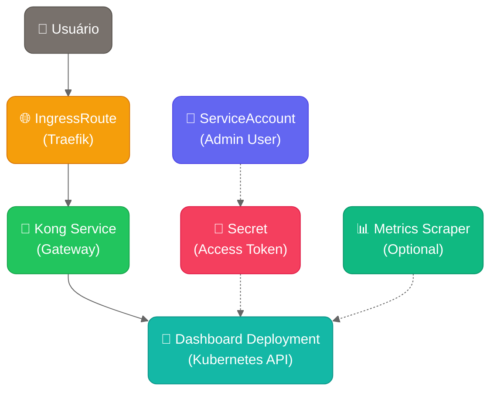

# 🎛️ Kubernetes Dashboard - Helm Chart

> **Interface web para gerenciamento do cluster Kubernetes** com acesso via Cloudflare Tunnel

## 🚀 **Instalação Rápida**

```bash
# Instalação básica
helm install dashboard charts/kubernetes-dashboard \
  --set domain=dashboard.meusite.com \
  --create-namespace \
  --namespace kubernetes-dashboard

# Verificar se funcionou
kubectl get pods -n kubernetes-dashboard
kubectl get ingressroute -n kubernetes-dashboard
```

## 🎯 **Arquitetura**



## 📋 **Configurações Essenciais**

| Parâmetro | Descrição | Padrão |
|-----------|-----------|---------|
| `domain` | **Domínio para acesso** | `dashboard.meusite.com` |
| `kubernetes-dashboard.app.scaling.replicas` | Número de réplicas | `1` |
| `kubernetes-dashboard.app.resources.requests.cpu` | CPU mínima | `100m` |
| `kubernetes-dashboard.app.resources.requests.memory` | Memória mínima | `200Mi` |

## ⚡ **Funcionalidades Opcionais**

| Parâmetro | Descrição | Padrão |
|-----------|-----------|---------|
| `kubernetes-dashboard.kong.proxy.tls.enabled` | HTTPS no Kong | `false` |
| `serviceAccount.create` | Criar ServiceAccount administrativo | `true` |
| `rbac.create` | Criar permissões administrativas | `true` |

## 🔧 **Exemplos de Uso**

### **Desenvolvimento Local**
```bash
helm install dashboard charts/kubernetes-dashboard \
  --set domain=dashboard.meusite.com \
  --create-namespace \
  --namespace kubernetes-dashboard
```

### **Produção com Domínio Próprio**
```bash
helm install dashboard charts/kubernetes-dashboard \
  --set domain=dashboard.empresa.com \
  --set kubernetes-dashboard.app.resources.limits.cpu=500m \
  --set kubernetes-dashboard.app.resources.limits.memory=500Mi \
  --create-namespace \
  --namespace kubernetes-dashboard
```

### **Alta Performance**
```bash
helm install dashboard charts/kubernetes-dashboard \
  --set domain=dashboard.empresa.com \
  --set kubernetes-dashboard.app.scaling.replicas=2 \
  --set kubernetes-dashboard.app.resources.limits.cpu=1000m \
  --set kubernetes-dashboard.app.resources.limits.memory=1Gi \
  --create-namespace \
  --namespace kubernetes-dashboard
```

## 🔑 **Acesso ao Dashboard**

### **1. Obter Token de Acesso**
```bash
# Obter token do ServiceAccount administrativo
# NOTA: Nome do secret segue padrão: {release-name}-admin-user-token
kubectl get secret -n kubernetes-dashboard {release-name}-admin-user-token -o jsonpath='{.data.token}' | base64 -d

# Exemplo para release chamado "dashboard":
kubectl get secret -n kubernetes-dashboard dashboard-admin-user-token -o jsonpath='{.data.token}' | base64 -d
```

### **2. Acessar Interface**
1. Abra: `https://seu-dominio.com`
2. Selecione: **Token**
3. Cole o token obtido no passo anterior
4. Clique em: **Sign In**

## 🧪 **Testes Funcionais**

### **Executar Testes Automáticos**
```bash
# Executar suite de testes do chart
helm test dashboard -n kubernetes-dashboard

# Verificar logs dos testes
kubectl logs -n kubernetes-dashboard -l app.kubernetes.io/component=test
```

## 🔍 **Verificação e Debug**

### **Status dos Recursos**
```bash
# Verificar pods
kubectl get pods -n kubernetes-dashboard

# Verificar services
kubectl get svc -n kubernetes-dashboard

# Verificar ingress
kubectl get ingressroute -n kubernetes-dashboard

# Verificar permissões
kubectl get clusterrolebinding | grep dashboard
```

### **Logs dos Componentes**
```bash
# Logs do Dashboard
kubectl logs -n kubernetes-dashboard deployment/kubernetes-dashboard-kubernetes-dashboard

# Logs do Kong Gateway
kubectl logs -n kubernetes-dashboard deployment/kubernetes-dashboard-kong

# Verificar eventos
kubectl get events -n kubernetes-dashboard --sort-by='.lastTimestamp'
```

## 🚨 **Troubleshooting**

### **Dashboard não carrega**
```bash
# 1. Verificar se pods estão rodando
kubectl get pods -n kubernetes-dashboard

# 2. Verificar logs do Kong (proxy)
kubectl logs -n kubernetes-dashboard deployment/kubernetes-dashboard-kong

# 3. Verificar configuração do Ingress
kubectl describe ingressroute -n kubernetes-dashboard
```

### **Erro de autenticação**
```bash
# 1. Verificar se o token existe (substitua {release-name} pelo nome da sua release)
kubectl get secret -n kubernetes-dashboard {release-name}-admin-user-token

# 2. Verificar permissões do ServiceAccount
kubectl describe clusterrolebinding {release-name}-admin-user

# 3. Verificar se ServiceAccount existe
kubectl get serviceaccount -n kubernetes-dashboard {release-name}-admin-user

# 4. Gerar novo token se necessário
kubectl delete secret -n kubernetes-dashboard {release-name}-admin-user-token
# O secret será recriado automaticamente
```

### **Problemas de rede**
```bash
# 1. Verificar se o Cloudflare Tunnel está ativo
kubectl get ingressroute -n kubernetes-dashboard -o yaml

# 2. Testar conectividade interna
kubectl run debug --image=curlimages/curl -it --rm -- \
  /bin/sh -c "curl -v http://kubernetes-dashboard-kong.kubernetes-dashboard.svc.cluster.local"
```

## 🔧 **Configurações Avançadas**

Para configurações avançadas, habilite a seção `advanced`:

```yaml
# values-custom.yaml
advanced:
  enabled: true
  
kubernetes-dashboard:
  app:
    security:
      allowInsecureLogin: false
      enableInsecureLogin: false
    ingress:
      annotations:
        traefik.ingress.kubernetes.io/router.middlewares: default-auth@kubernetescrd
```

```bash
helm upgrade dashboard charts/kubernetes-dashboard \
  -f values-custom.yaml
```

## ⚠️ **Considerações de Segurança**

- 🔐 **Dashboard possui acesso administrativo** ao cluster
- 🌐 **Configure acesso apenas via rede confiável**
- 🔑 **Troque tokens regularmente** em produção  
- 📊 **Monitor acessos** via logs do Kong
- 🛡️ **Use RBAC granular** para usuários específicos

## 📚 **Documentação Oficial**

- **[Kubernetes Dashboard](https://github.com/kubernetes/dashboard)** - Repositório oficial
- **[Chart Helm](https://artifacthub.io/packages/helm/k8s-dashboard/kubernetes-dashboard)** - ArtifactHub
- **[Kong Gateway](https://docs.konghq.com/)** - Documentação do proxy

---

## 🤝 **Contribuindo**

Siga os [guidelines de desenvolvimento](../../docs/CHART_GUIDELINES.md) para contribuições.

---

**💡 Dica**: Este chart segue a **nova abordagem simplificada** - comandos simples, configuração intuitiva! 