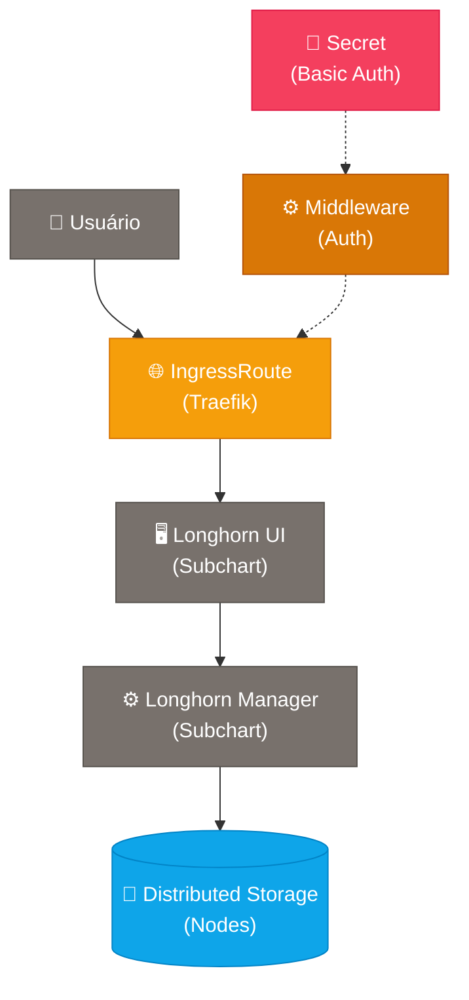

# 💾 Longhorn - Helm Chart Simplificado

**Sistema de armazenamento distribuído** para Kubernetes com interface web para gerenciamento de volumes persistentes.

## 🏗️ **Arquitetura**



**Recursos criados por este chart:**
- 🌐 **IngressRoute**: Exposição externa via Traefik
- 🔐 **Secret**: Autenticação básica (se `auth.enabled=true`)
- ⚙️ **Middleware**: Middleware de autenticação Traefik

**Recursos do subchart oficial:**
- 🖥️ **Longhorn UI**: Interface web de gerenciamento
- ⚙️ **Longhorn Manager**: Sistema principal de armazenamento
- 💾 **Distributed Storage**: Armazenamento distribuído nos nodes

## 🚀 **Instalação Rápida**

### **Básica (com autenticação)**
```bash
helm install longhorn charts/longhorn \
  --set domain=longhorn.meusite.com \
  --set auth.password=minhasenha123 \
  --create-namespace \
  --namespace longhorn-system
```

### **Sem autenticação (não recomendado para produção)**
```bash
helm install longhorn charts/longhorn \
  --set domain=longhorn.meusite.com \
  --set auth.enabled=false \
  --create-namespace \
  --namespace longhorn-system
```

### **Com HTTPS**
```bash
helm install longhorn charts/longhorn \
  --set domain=longhorn.meusite.com \
  --set auth.password=minhasenha123 \
  --set tls.enabled=true \
  --create-namespace \
  --namespace longhorn-system
```

## ⚙️ **Configurações Principais**

| Parâmetro | Descrição | Valor Padrão |
|-----------|-----------|--------------|
| `domain` | URL onde acessar a interface web | `longhorn.meusite.com` |
| `auth.enabled` | Habilitar autenticação básica | `true` |
| `auth.username` | Usuário para login | `admin` |
| `auth.password` | **Senha obrigatória** | `""` (deve ser definida) |
| `tls.enabled` | Habilitar HTTPS automático | `false` |

## 🔧 **Configurações Avançadas do Longhorn**

### **Habilitando configurações avançadas**
```bash
helm install longhorn charts/longhorn \
  --set domain=longhorn.empresa.com \
  --set auth.password=senhasegura123 \
  --set advanced.enabled=true \
  --set advanced.longhorn.defaultSettings.defaultReplicaCount=3 \
  --create-namespace \
  --namespace longhorn-system
```

### **📊 Principais configurações avançadas disponíveis**

#### **🗄️ Configurações de Storage**
| Parâmetro | Descrição | Padrão |
|-----------|-----------|---------|
| `advanced.longhorn.persistence.defaultClassReplicaCount` | Réplicas padrão para novos volumes | `2` |
| `advanced.longhorn.persistence.defaultDataLocality` | Localidade dos dados | `"disabled"` |
| `advanced.longhorn.persistence.defaultFsType` | Sistema de arquivos padrão | `"ext4"` |

#### **🔄 Configurações de Backup**
| Parâmetro | Descrição | Exemplo |
|-----------|-----------|---------|
| `advanced.longhorn.defaultSettings.backupTarget` | URL do destino de backup | `"s3://meu-bucket@us-east-1/"` |
| `advanced.longhorn.defaultSettings.backupTargetCredentialSecret` | Secret com credenciais | `"minio-secret"` |
| `advanced.longhorn.defaultSettings.backupstorePollInterval` | Intervalo de verificação (segundos) | `300` |

#### **🚀 Configurações de Performance**
| Parâmetro | Descrição | Padrão |
|-----------|-----------|---------|
| `advanced.longhorn.defaultSettings.guaranteedInstanceManagerCPU` | % CPU reservada para Instance Manager | `12` |
| `advanced.longhorn.defaultSettings.storageOverProvisioningPercentage` | % de over-provisioning permitido | `100` |
| `advanced.longhorn.defaultSettings.storageMinimalAvailablePercentage` | % mínimo de espaço livre | `25` |

#### **🏷️ Configurações de Agendamento**
| Parâmetro | Descrição | Padrão |
|-----------|-----------|---------|
| `advanced.longhorn.longhornUI.replicas` | Réplicas da interface web | `2` |
| `advanced.longhorn.longhornManager.nodeSelector` | Seletor de nodes para Manager | `{}` |
| `advanced.longhorn.defaultSettings.createDefaultDiskLabeledNodes` | Criar disco apenas em nodes com label | `false` |

### **💡 Exemplos de uso avançado**

#### **📦 Para backup em S3**
```bash
helm install longhorn charts/longhorn \
  --set domain=longhorn.empresa.com \
  --set auth.password=senha123 \
  --set advanced.enabled=true \
  --set advanced.longhorn.defaultSettings.backupTarget="s3://longhorn-backup@us-east-1/" \
  --set advanced.longhorn.defaultSettings.backupTargetCredentialSecret="aws-secret" \
  --create-namespace \
  --namespace longhorn-system
```

#### **🎯 Para alta disponibilidade**
```bash
helm install longhorn charts/longhorn \
  --set domain=longhorn.empresa.com \
  --set auth.password=senha123 \
  --set advanced.enabled=true \
  --set advanced.longhorn.persistence.defaultClassReplicaCount=3 \
  --set advanced.longhorn.longhornUI.replicas=3 \
  --set advanced.longhorn.defaultSettings.defaultReplicaCount=3 \
  --create-namespace \
  --namespace longhorn-system
```

#### **⚡ Para melhor performance**
```bash
helm install longhorn charts/longhorn \
  --set domain=longhorn.empresa.com \
  --set auth.password=senha123 \
  --set advanced.enabled=true \
  --set advanced.longhorn.persistence.defaultDataLocality="best-effort" \
  --set advanced.longhorn.defaultSettings.guaranteedInstanceManagerCPU=20 \
  --set advanced.longhorn.defaultSettings.storageOverProvisioningPercentage=200 \
  --create-namespace \
  --namespace longhorn-system
```

## 🔍 **Verificação da Instalação**

```bash
# Verificar pods
kubectl get pods -n longhorn-system

# Verificar interface web
kubectl get ingressroute -n longhorn-system

# Verificar StorageClass criada
kubectl get storageclass
```

## 📊 **Criação de Volume de Teste**

```bash
# Criar PVC de teste
kubectl apply -f - <<EOF
apiVersion: v1
kind: PersistentVolumeClaim
metadata:
  name: teste-longhorn
spec:
  accessModes:
    - ReadWriteOnce
  storageClassName: longhorn
  resources:
    requests:
      storage: 1Gi
EOF

# Verificar volume criado
kubectl get pvc teste-longhorn
kubectl get pv
```

## 🐛 **Troubleshooting**

### **🌐 Interface não acessível via domínio**

#### **1. Verificar se todos os recursos foram criados**
```bash
# Verificar se IngressRoute, Middleware e Secret existem
kubectl get ingressroute,middleware,secret -n longhorn-system

# Deve mostrar:
# ingressroute.traefik.io/longhorn-longhorn
# middleware.traefik.io/longhorn-longhorn-auth  
# secret/longhorn-longhorn-auth
```

#### **2. Verificar logs do Traefik para erros de autenticação**
```bash
# Verificar se há erros relacionados ao Longhorn
kubectl logs -n kube-system -l app.kubernetes.io/name=traefik | grep longhorn

# ❌ Se aparecer este erro:
# error="error parsing BasicUser: admin:admin:$2a$10$..."
# Significa problema no formato do secret de autenticação
```

#### **🔧 Solução para erro de parsing BasicUser**
Se você ver o erro `error parsing BasicUser: admin:admin:$2a$10$...`, significa que há um bug no template do secret. Verifique o formato:

```bash
# Verificar formato do secret (deve ser "username:hash", NÃO "username:username:hash")
kubectl get secret longhorn-longhorn-auth -n longhorn-system -o jsonpath='{.data.users}' | base64 -d

# ✅ Formato correto: admin:$2a$10$hash...
# ❌ Formato incorreto: admin:admin:$2a$10$hash...
```

**Para corrigir**, faça upgrade do chart:
```bash
helm upgrade longhorn charts/longhorn \
  --set domain=seu-dominio.com \
  --set auth.password=sua-senha \
  --namespace longhorn-system
```

#### **3. Verificar se o serviço existe**
```bash
# Verificar se longhorn-frontend existe
kubectl get svc longhorn-frontend -n longhorn-system

# Deve mostrar:
# NAME                TYPE        CLUSTER-IP      PORT(S)
# longhorn-frontend   ClusterIP   10.x.x.x        80/TCP
```

#### **4. Testar acesso interno primeiro**
```bash
# Teste interno para verificar se o serviço responde
kubectl run test-access --image=curlimages/curl --rm -i --tty --restart=Never -- \
  curl -H "Host: seu-dominio.com" http://longhorn-frontend.longhorn-system.svc.cluster.local

# Deve retornar HTML da interface do Longhorn
```

#### **5. Verificar configuração DNS/Proxy**
```bash
# Se teste interno funciona mas externo não, verificar:
# - DNS aponta para o cluster?
# - Firewall/Proxy permite tráfego?
# - Certificados TLS se tls.enabled=true?

# Testar resolução DNS:
nslookup seu-dominio.com

# Testar conectividade:
curl -H "Host: seu-dominio.com" http://IP-DO-CLUSTER
```

### **Interface não acessível**
```bash
# Verificar IngressRoute
kubectl describe ingressroute longhorn -n longhorn-system

# Verificar se o serviço existe
kubectl get svc longhorn-frontend -n longhorn-system
```

### **Pods não inicializando**
```bash
# Verificar nodes compatíveis
kubectl get nodes -o wide

# Verificar recursos disponíveis
kubectl describe nodes

# Logs do manager
kubectl logs -n longhorn-system daemonset/longhorn-manager
```

### **StorageClass não aparece**
```bash
# Aguardar inicialização completa
kubectl wait --for=condition=ready pod -l app=longhorn-manager -n longhorn-system --timeout=300s

# Verificar se foi criada
kubectl get storageclass longhorn
```

### **Problemas com backup**
```bash
# Verificar configurações de backup
kubectl get settings.longhorn.io backup-target -n longhorn-system -o yaml

# Verificar secret de credenciais
kubectl get secret -n longhorn-system
```

## ✅ **Teste de Validação Completa**

Use este comando para verificar se tudo está funcionando:

```bash
# 1. Verificar pods
kubectl get pods -n longhorn-system | grep -E "(Running|Completed)"

# 2. Verificar recursos de rede
kubectl get ingressroute,middleware,secret -n longhorn-system

# 3. Verificar secret de autenticação (formato correto)
kubectl get secret longhorn-longhorn-auth -n longhorn-system -o jsonpath='{.data.users}' | base64 -d | grep -E "^[^:]+:\$"

# 4. Verificar serviços
kubectl get svc longhorn-frontend -n longhorn-system

# 5. Teste de acesso (substitua pelo seu domínio)
curl -H "Host: longhorn.seu-dominio.com" http://IP-DO-CLUSTER
```

Se todos os comandos acima funcionarem, o problema pode estar na configuração DNS/proxy externa.

## 📚 **Recursos Úteis**

- 📖 **Interface Web**: Acesse via domínio configurado
- 🔗 **Documentação**: [longhorn.io/docs](https://longhorn.io/docs/)
- ⚙️ **Configurações**: [Helm Values Reference](https://longhorn.io/docs/1.9.0/references/helm-values/)
- 🎯 **Use Cases**: Ideal para volumes persistentes em clusters auto-hospedados
- 🚀 **Performance**: Excelente para aplicações que precisam de armazenamento durável

## ⚠️ **Requisitos**

- **Kubernetes**: 1.21+
- **Nodes**: Linux com `/var/lib/longhorn` disponível
- **Dependências**: iscsiadm, NFSv4 client (opcional)
- **Storage**: Espaço em disco disponível nos nodes
- **Memória**: Mínimo 2GB por node
- **CPU**: Mínimo 2 cores por node para production

## 🎛️ **Configurações do Chart Antigo Migradas**

Esta versão do chart migrou **todas as configurações importantes** do chart anterior:

✅ **Persistência**: defaultClass, defaultClassReplicaCount, defaultDataLocality  
✅ **Serviços**: Configurações de UI e Manager  
✅ **Defaults do Sistema**: backupTarget, defaultReplicaCount, garantias de CPU  
✅ **Tolerâncias**: CriticalAddonsOnly para todos os componentes  
✅ **Performance**: storageOverProvisioningPercentage, CPU guarantees  
✅ **Limpeza**: orphanAutoDeletion, autoSalvage, autoCleanupSystemGeneratedSnapshot  

---

💡 **Dica**: Para ambientes de produção, sempre habilite autenticação (`auth.enabled=true`), configure backups adequados e use pelo menos 3 réplicas para alta disponibilidade! 