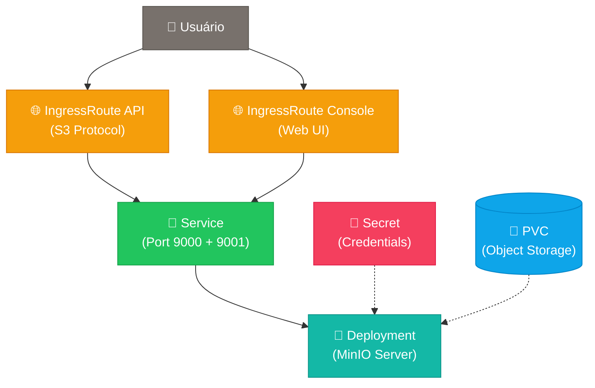

# 🗂️ MinIO - Helm Chart Simplificado

**Servidor de armazenamento de objetos S3-compatível** com console web de gerenciamento para desenvolvimento e produção.

> ⚠️ **IMPORTANTE**: Este chart usa a versão `RELEASE.2025-04-22T22-12-26Z` do MinIO (anterior à mais recente) para manter **funcionalidades administrativas completas** no Console Web. A partir da versão `RELEASE.2025-05-24T17-08-30Z`, o MinIO removeu funcionalidades administrativas da interface web (user management, access keys, policies), exigindo o uso do cliente `mc` para administração.

## 🏗️ **Arquitetura**



**Recursos criados por este chart:**
- 🌐 **IngressRoute API**: Exposição da API S3 (port 9000) via `domains.api`
- 🌐 **IngressRoute Console**: Exposição da interface web (port 9001) via `domains.console`
- 🔗 **Service**: Load balancer interno com duas portas (API + Console)
- 🚀 **Deployment**: Container MinIO server
- 🔐 **Secret**: Credenciais root (MINIO_ROOT_USER/PASSWORD)
- 💾 **PVC**: Armazenamento persistente para objetos

**Acessos disponíveis:**
- 📦 **API S3**: `https://s3.meusite.com` (para SDKs, mc client, aplicações)
- 🖥️ **Console Web**: `https://minio.meusite.com` (interface administrativa)

## 🚀 **Instalação Rápida**

### **Básica (recomendada)**
```bash
helm install minio charts/minio \
  --set domains.api=s3.meusite.com \
  --set domains.console=minio.meusite.com \
  --set auth.password=minhasenhasegura123 \
  --create-namespace \
  --namespace minio
```

### **Com HTTPS**
```bash
helm install minio charts/minio \
  --set domains.api=s3.meusite.com \
  --set domains.console=minio.meusite.com \
  --set auth.password=minhasenhasegura123 \
  --set tls.enabled=true \
  --create-namespace \
  --namespace minio
```

### **Com configurações personalizadas**
```bash
helm install minio charts/minio \
  --set domains.api=s3.empresa.com \
  --set domains.console=minio.empresa.com \
  --set auth.username=minio-admin \
  --set auth.password=senha-muito-segura \
  --set storage.size=100Gi \
  --set storage.storageClass=fast-ssd \
  --create-namespace \
  --namespace minio
```

## ⚙️ **Configurações Principais**

| Parâmetro | Descrição | Valor Padrão |
|-----------|-----------|--------------|
| `domains.api` | URL da API S3 (para SDKs, mc, etc.) | `s3.meusite.com` |
| `domains.console` | URL da interface web | `minio.meusite.com` |
| `auth.username` | Usuário root do MinIO | `admin` |
| `auth.password` | **Senha obrigatória** | `""` (deve ser definida) |
| `storage.size` | Tamanho do volume persistente | `30Gi` |
| `storage.storageClass` | Classe de armazenamento | `longhorn` |
| `tls.enabled` | Habilitar HTTPS automático | `false` |

## 🔧 **Configurações Avançadas**

### **Habilitando configurações avançadas**
```bash
helm install minio charts/minio \
  --set domains.api=s3.empresa.com \
  --set domains.console=minio.empresa.com \
  --set auth.password=senha123 \
  --set advanced.enabled=true \
  --set advanced.minio.image.tag=RELEASE.2025-04-22T22-12-26Z \
  --create-namespace \
  --namespace minio
```

### **📊 Principais configurações avançadas disponíveis**

#### **🖼️ Configurações de Imagem**
| Parâmetro | Descrição | Padrão |
|-----------|-----------|---------|
| `advanced.minio.image.repository` | Repositório da imagem | `quay.io/minio/minio` |
| `advanced.minio.image.tag` | Tag da imagem | `RELEASE.2025-04-22T22-12-26Z` |
| `advanced.minio.image.pullPolicy` | Política de pull da imagem | `IfNotPresent` |

#### **🌐 Configurações de Servidor**
| Parâmetro | Descrição | Exemplo |
|-----------|-----------|---------|
| `advanced.minio.server.env` | Variáveis de ambiente personalizadas | `{"MINIO_COMPRESSION_ENABLE": "on"}` |

#### **🩺 Configurações de Health Checks**
| Parâmetro | Descrição | Padrão |
|-----------|-----------|---------|
| `advanced.minio.health.liveness.enabled` | Habilitar liveness probe | `true` |
| `advanced.minio.health.readiness.enabled` | Habilitar readiness probe | `true` |

#### **🔐 Configurações de Segurança**
| Parâmetro | Descrição | Padrão |
|-----------|-----------|---------|
| `advanced.minio.security.runAsUser` | UID do usuário do container | `1000` |
| `advanced.minio.security.runAsGroup` | GID do grupo do container | `1000` |
| `advanced.minio.security.fsGroup` | Grupo do filesystem | `1000` |

### **💡 Exemplos de uso avançado**

#### **🗜️ Com compressão habilitada**
```bash
helm install minio charts/minio \
  --set domains.api=s3.empresa.com \
  --set domains.console=minio.empresa.com \
  --set auth.password=senha123 \
  --set advanced.enabled=true \
  --set advanced.minio.server.env.MINIO_COMPRESSION_ENABLE=on \
  --create-namespace \
  --namespace minio
```

#### **🚀 Para alta performance**
```bash
helm install minio charts/minio \
  --set domains.api=s3.empresa.com \
  --set domains.console=minio.empresa.com \
  --set auth.password=senha123 \
  --set storage.size=500Gi \
  --set storage.storageClass=nvme-fast \
  --set resources.requests.cpu=1000m \
  --set resources.requests.memory=2Gi \
  --set resources.limits.cpu=2000m \
  --set resources.limits.memory=4Gi \
  --create-namespace \
  --namespace minio
```

#### **🔒 Com configurações de segurança**
```bash
helm install minio charts/minio \
  --set domains.api=s3.empresa.com \
  --set domains.console=minio.empresa.com \
  --set auth.password=senha123 \
  --set advanced.enabled=true \
  --set advanced.minio.security.runAsUser=1001 \
  --set advanced.minio.persistence.retainOnDelete=true \
  --create-namespace \
  --namespace minio
```

## 🔍 **Verificação da Instalação**

```bash
# Verificar pods
kubectl get pods -n minio

# Verificar serviços
kubectl get svc -n minio

# Verificar IngressRoutes
kubectl get ingressroute -n minio

# Verificar PVC
kubectl get pvc -n minio
```

## 📦 **Teste com MinIO Client (mc)**

```bash
# Instalar mc (MinIO Client)
curl https://dl.min.io/client/mc/release/linux-amd64/mc \
  --output mc && chmod +x mc

# Configurar alias
./mc alias set minio-exemplo https://s3.meusite.com admin minhasenhasegura123

# Testar conectividade
./mc admin info minio-exemplo

# Criar bucket de teste
./mc mb minio-exemplo/teste

# Listar buckets
./mc ls minio-exemplo

# Upload de arquivo
echo "Hello MinIO!" > teste.txt
./mc cp teste.txt minio-exemplo/teste/

# Download de arquivo
./mc cp minio-exemplo/teste/teste.txt downloaded.txt
```

## 🐛 **Troubleshooting**

### **🌐 Interface não acessível via domínio**

#### **1. Verificar se todos os recursos foram criados**
```bash
# Verificar se IngressRoutes, Services e Deployment existem
kubectl get ingressroute,service,deployment,pvc -n minio

# Deve mostrar:
# ingressroute.traefik.io/minio-minio-api
# ingressroute.traefik.io/minio-minio-console
# service/minio-minio
# deployment.apps/minio-minio
# persistentvolumeclaim/minio-minio-data
```

#### **2. Verificar logs do Traefik**
```bash
# Verificar se há erros relacionados ao MinIO
kubectl logs -n kube-system -l app.kubernetes.io/name=traefik | grep minio
```

#### **3. Verificar se o serviço está respondendo**
```bash
# Verificar endpoints do serviço
kubectl get endpoints -n minio

# Testar acesso interno
kubectl run test-access --image=curlimages/curl --rm -i --tty --restart=Never -- \
  curl -v http://minio-minio.minio.svc.cluster.local:9000/minio/health/live
```

### **Pod não inicializa**
```bash
# Verificar status do pod
kubectl describe pod -l app.kubernetes.io/name=minio -n minio

# Verificar logs do container
kubectl logs -l app.kubernetes.io/name=minio -n minio

# Verificar se PVC foi criado
kubectl describe pvc minio-minio-data -n minio
```

### **Problemas de autenticação**
```bash
# Verificar secret com credenciais
kubectl get secret minio-minio-credentials -n minio -o yaml

# Decodificar credenciais
kubectl get secret minio-minio-credentials -n minio -o jsonpath='{.data.MINIO_ROOT_USER}' | base64 -d
kubectl get secret minio-minio-credentials -n minio -o jsonpath='{.data.MINIO_ROOT_PASSWORD}' | base64 -d
```

### **PVC não pode ser montado**
```bash
# Verificar StorageClass
kubectl get storageclass

# Verificar se há espaço disponível nos nodes
kubectl describe nodes | grep -A5 "Allocated resources"

# Verificar eventos do PVC
kubectl describe pvc minio-minio-data -n minio
```

## ✅ **Teste de Validação Completa**

Use este comando para verificar se tudo está funcionando:

```bash
# 1. Verificar pods rodando
kubectl get pods -n minio | grep -E "(Running|Completed)"

# 2. Verificar recursos de rede
kubectl get ingressroute,service -n minio

# 3. Verificar armazenamento
kubectl get pvc -n minio

# 4. Teste de conectividade API
curl -I https://s3.meusite.com/minio/health/live

# 5. Teste de conectividade Console
curl -I https://minio.meusite.com
```

## 🔐 **Funcionalidades Administrativas**

Esta versão mantém **todas as funcionalidades administrativas** disponíveis via Console Web:

✅ **Identity → Users**: Criar e gerenciar usuários  
✅ **Identity → Policies**: Criar e editar políticas de acesso  
✅ **Identity → Service Accounts**: Criar access keys  
✅ **Access Keys**: Gerenciar chaves de API  
✅ **Settings**: Configurações do sistema  

### **Acesso ao Console Administrativo**
1. Acesse via `https://[domains.console]`
2. Login: `admin` / `[auth.password]`
3. **Todas as opções administrativas estarão disponíveis!**

## 📚 **Recursos Úteis**

- 🌐 **Console Web**: Acesse via `domains.console` configurado  
- 🛠️ **MinIO Client**: [Download mc](https://min.io/download#/linux)
- 📖 **Documentação**: [MinIO Documentation](https://min.io/docs/)
- 🔗 **API Reference**: [S3 API Compatibility](https://docs.min.io/docs/minio-server-limits-per-tenant.html)
- 🎯 **Use Cases**: Ideal para armazenamento de objetos, backup, data lake, CDN origin
- 🚀 **SDKs**: Disponível para Python, Java, Go, JavaScript, .NET, PHP

## ⚠️ **Requisitos**

- **Kubernetes**: 1.21+
- **Traefik**: Para IngressRoutes
- **Storage**: Classe de armazenamento com suporte a ReadWriteOnce
- **Memória**: Mínimo 512Mi por instância
- **CPU**: Mínimo 250m por instância
- **Disco**: Espaço conforme `storage.size` configurado

## 🎛️ **Comparação com Chart Antigo**

Esta versão do chart **migrou do boilerplate** para implementação direta:

✅ **Versão Atualizada**: `2024-03-21` → **`2025-04-22`** (Última versão com admin completo!)  
✅ **Interface Simplificada**: 2 domínios em vez de múltiplas configurações  
✅ **Recursos**: Secret, Deployment, Service, PVC, 2x IngressRoutes  
✅ **Labels Kubernetes**: Padrão completo aplicado  
✅ **Configurações Avançadas**: Opcionais e bem documentadas  
✅ **Health Checks**: Liveness e readiness probes configuráveis  
✅ **Segurança**: Contextos de segurança e retenção de dados  

---

💡 **Dica**: Para desenvolvimento, use volumes pequenos (`storage.size=10Gi`). Para produção, sempre configure `advanced.minio.persistence.retainOnDelete=true` e backups regulares! 