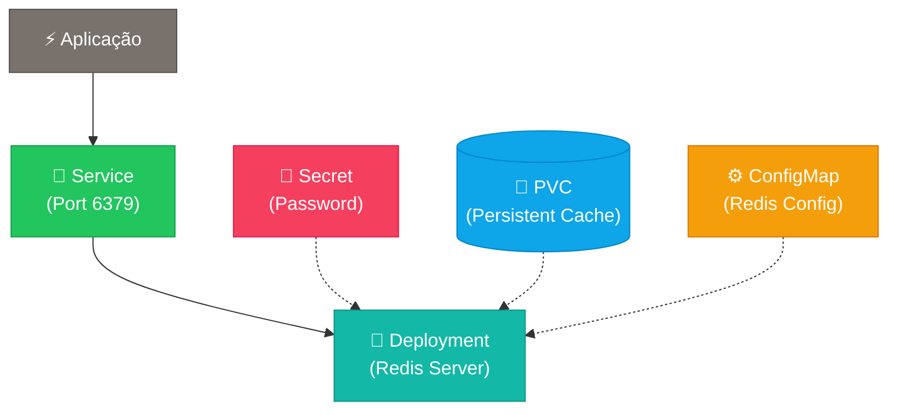

# 🔴 Redis - Helm Chart Simplificado

**Cache Redis in-memory** altamente configurável para desenvolvimento e produção.

## 🏗️ **Arquitetura**



**Recursos criados por este chart:**
- 🔗 **Service**: Exposição interna do Redis (port 6379)
- 🚀 **Deployment**: Container Redis server
- 🔐 **Secret**: Credenciais (REDIS_PASSWORD)
- 💾 **PVC**: Armazenamento persistente para cache (opcional)
- ⚙️ **ConfigMap**: Configurações de performance e persistência

**Conexão disponível:**
- 📦 **Redis**: `<release-name>-redis.<namespace>.svc.cluster.local:6379`

## 🚀 **Instalação Rápida**

### **Básica (recomendada)**
```bash
helm install redis charts/redis \
  --set auth.password=minhasenhasegura123 \
  --create-namespace \
  --namespace redis
```

### **Para cache temporário (sem persistência)**
```bash
helm install redis-cache charts/redis \
  --set auth.password=minhasenhasegura123 \
  --set persistence.enabled=false \
  --create-namespace \
  --namespace redis
```

### **Para produção**
```bash
helm install redis charts/redis \
  --set auth.password=senha-ultra-segura \
  --set storage.size=10Gi \
  --set storage.storageClass=fast-ssd \
  --set resources.limits.cpu=1000m \
  --set resources.limits.memory=2Gi \
  --set redis.maxMemory=1536mb \
  --create-namespace \
  --namespace redis
```

## ⚙️ **Configurações Principais**

| Parâmetro | Descrição | Valor Padrão |
|-----------|-----------|--------------|
| `auth.password` | **Senha obrigatória** | `""` (deve ser definida) |
| `storage.size` | Tamanho do volume persistente | `2Gi` |
| `storage.storageClass` | Classe de armazenamento | `""` (padrão) |
| `persistence.enabled` | Habilita armazenamento persistente | `true` |
| `resources.limits.cpu` | CPU máxima | `500m` |
| `resources.limits.memory` | Memória máxima | `1Gi` |
| `redis.maxMemory` | Memória máxima do Redis | `768mb` |
| `redis.maxMemoryPolicy` | Política de remoção | `allkeys-lru` |

## 🔧 **Configurações Avançadas**

### **Habilitando configurações avançadas**
```bash
helm install redis charts/redis \
  --set auth.password=senha123 \
  --set advanced.enabled=true \
  --set advanced.redis.config.maxClients=20000 \
  --create-namespace \
  --namespace redis
```

### **📊 Principais configurações avançadas disponíveis**

#### **🖼️ Configurações de Imagem**
| Parâmetro | Descrição | Padrão |
|-----------|-----------|---------|
| `image.repository` | Repositório da imagem | `redis` |
| `image.tag` | Tag da imagem | `7.4.1-alpine` |
| `image.pullPolicy` | Política de pull da imagem | `IfNotPresent` |

#### **⚡ Configurações de Performance**
| Parâmetro | Descrição | Padrão |
|-----------|-----------|---------|
| `advanced.redis.config.maxClients` | Conexões máximas | `10000` |
| `advanced.redis.config.timeout` | Timeout de conexão | `0` (sem timeout) |
| `advanced.redis.config.tcpKeepAlive` | Keep alive TCP | `300` |
| `advanced.redis.config.tcpBacklog` | Backlog de conexões | `511` |

#### **💾 Configurações de Persistência**
| Parâmetro | Descrição | Padrão |
|-----------|-----------|---------|
| `redis.appendOnly` | Habilita persistência AOF | `true` |
| `redis.appendFsync` | Frequência de sincronização | `everysec` |
| `advanced.redis.config.save` | Configuração RDB | `["900 1", "300 10", "60 10000"]` |

#### **🩺 Configurações de Health Checks**
| Parâmetro | Descrição | Padrão |
|-----------|-----------|---------|
| `advanced.redis.health.liveness.enabled` | Habilitar liveness probe | `true` |
| `advanced.redis.health.readiness.enabled` | Habilitar readiness probe | `true` |

#### **🔐 Configurações de Segurança**
| Parâmetro | Descrição | Padrão |
|-----------|-----------|---------|
| `advanced.redis.security.runAsUser` | UID do usuário do container | `999` |
| `advanced.redis.security.runAsGroup` | GID do grupo do container | `999` |
| `advanced.redis.security.fsGroup` | Grupo do filesystem | `999` |

### **💡 Exemplos de uso avançado**

#### **🚀 Para alta performance (cache puro)**
```bash
helm install redis-cache charts/redis \
  --set auth.password=senha123 \
  --set persistence.enabled=false \
  --set redis.maxMemory=4gb \
  --set redis.maxMemoryPolicy=allkeys-lru \
  --set advanced.enabled=true \
  --set advanced.redis.config.maxClients=50000 \
  --set advanced.redis.config.tcpKeepAlive=60 \
  --set resources.limits.cpu=2000m \
  --set resources.limits.memory=5Gi \
  --create-namespace \
  --namespace redis
```

#### **📊 Para análise e monitoramento**
```bash
helm install redis-analytics charts/redis \
  --set auth.password=senha123 \
  --set advanced.enabled=true \
  --set advanced.redis.config.notifyKeyspaceEvents=AKE \
  --set advanced.redis.config.logLevel=verbose \
  --set persistence.retainOnDelete=true \
  --create-namespace \
  --namespace redis
```

#### **🔒 Com configurações de segurança**
```bash
helm install redis-secure charts/redis \
  --set auth.password=senha123 \
  --set advanced.enabled=true \
  --set advanced.redis.security.runAsUser=1001 \
  --set advanced.redis.config.protectedMode=true \
  --set persistence.retainOnDelete=true \
  --create-namespace \
  --namespace redis
```

#### **💾 Para persistência crítica**
```bash
helm install redis-persistent charts/redis \
  --set auth.password=senha123 \
  --set redis.appendOnly=true \
  --set redis.appendFsync=always \
  --set storage.size=50Gi \
  --set storage.storageClass=premium-ssd \
  --set persistence.retainOnDelete=true \
  --set advanced.enabled=true \
  --set advanced.redis.config.save='["300 1", "60 100"]' \
  --create-namespace \
  --namespace redis
```

## 🔍 **Verificação da Instalação**

```bash
# Verificar pods
kubectl get pods -n redis

# Verificar serviços
kubectl get svc -n redis

# Verificar PVC
kubectl get pvc -n redis

# Verificar logs
kubectl logs -l app.kubernetes.io/name=redis -n redis
```

## 🔌 **Teste de Conexão**

### **Via kubectl (temporário)**
```bash
# Conectar no Redis usando redis-cli
kubectl run redis-client --rm --tty -i --restart='Never' \
  --namespace redis \
  --image redis:7.4.1-alpine \
  --command -- redis-cli -h redis-redis -a minhasenhasegura123

# Testar conectividade básica
kubectl run redis-test --rm --tty -i --restart='Never' \
  --namespace redis \
  --image redis:7.4.1-alpine \
  --command -- redis-cli -h redis-redis -a minhasenhasegura123 ping

# Teste de operações básicas
kubectl run redis-ops --rm --tty -i --restart='Never' \
  --namespace redis \
  --image redis:7.4.1-alpine \
  --command -- redis-cli -h redis-redis -a minhasenhasegura123 \
  --eval "return redis.call('set', 'test', 'hello'); return redis.call('get', 'test');"
```

### **Via aplicação interna**
```yaml
# Exemplo de conexão em uma aplicação
apiVersion: v1
kind: Pod
metadata:
  name: app-example
spec:
  containers:
  - name: app
    image: alpine:latest
    env:
    - name: REDIS_URL
      value: "redis://:minhasenhasegura123@redis-redis.redis.svc.cluster.local:6379"
    command: ["sleep", "3600"]
```

### **String de conexão padrão**
```
Host: redis-redis.redis.svc.cluster.local
Port: 6379
Password: [auth.password]
URL: redis://:[auth.password]@redis-redis.redis.svc.cluster.local:6379
```

### **Comandos Redis úteis**
```bash
# Dentro do redis-cli:
# INFO                  # Informações do servidor
# CONFIG GET "*"        # Ver todas as configurações
# DBSIZE               # Número de chaves no banco
# MEMORY USAGE <key>   # Uso de memória de uma chave
# MONITOR              # Monitorar comandos em tempo real
# FLUSHALL             # Limpar todos os dados (CUIDADO!)
```

## 🐛 **Troubleshooting**

### **Pod não inicializa**
```bash
# Verificar status do pod
kubectl describe pod -l app.kubernetes.io/name=redis -n redis

# Verificar logs do container
kubectl logs -l app.kubernetes.io/name=redis -n redis

# Verificar configuração do Redis
kubectl get configmap redis-redis-config -n redis -o yaml
```

### **Problemas de conexão**
```bash
# Testar conectividade interna
kubectl run redis-test --rm --tty -i --restart='Never' \
  --namespace redis \
  --image busybox \
  --command -- nc -zv redis-redis 6379

# Verificar service e endpoints
kubectl get svc,endpoints -n redis
```

### **Problemas de autenticação**
```bash
# Verificar secret com senha
kubectl get secret redis-redis-credentials -n redis -o yaml

# Decodificar senha
kubectl get secret redis-redis-credentials -n redis -o jsonpath='{.data.REDIS_PASSWORD}' | base64 -d

# Testar autenticação
kubectl run redis-auth-test --rm --tty -i --restart='Never' \
  --namespace redis \
  --image redis:7.4.1-alpine \
  --command -- redis-cli -h redis-redis -a $(kubectl get secret redis-redis-credentials -n redis -o jsonpath='{.data.REDIS_PASSWORD}' | base64 -d) ping
```

### **Performance baixa**
```bash
# Verificar configurações de recursos
kubectl describe pod -l app.kubernetes.io/name=redis -n redis | grep -A 10 Resources

# Verificar uso de memória do Redis
kubectl run redis-memory --rm --tty -i --restart='Never' \
  --namespace redis \
  --image redis:7.4.1-alpine \
  --command -- redis-cli -h redis-redis -a senha123 INFO memory

# Verificar configuração de maxmemory
kubectl run redis-config --rm --tty -i --restart='Never' \
  --namespace redis \
  --image redis:7.4.1-alpine \
  --command -- redis-cli -h redis-redis -a senha123 CONFIG GET maxmemory*
```

### **PVC não pode ser montado**
```bash
# Verificar StorageClass
kubectl get storageclass

# Verificar se há espaço disponível nos nodes
kubectl describe nodes | grep -A5 "Allocated resources"

# Verificar eventos do PVC
kubectl describe pvc redis-redis-data -n redis
```

## ✅ **Teste de Validação Completa**

Use este comando para verificar se tudo está funcionando:

```bash
# 1. Verificar pods rodando
kubectl get pods -n redis | grep -E "(Running|Completed)"

# 2. Verificar recursos de rede
kubectl get service,endpoints -n redis

# 3. Verificar armazenamento (se habilitado)
kubectl get pvc -n redis

# 4. Teste de conectividade
kubectl run redis-ping --rm --tty -i --restart='Never' \
  --namespace redis \
  --image redis:7.4.1-alpine \
  --command -- redis-cli -h redis-redis -a minhasenhasegura123 ping

# 5. Teste de operação básica
kubectl run redis-set-get --rm --tty -i --restart='Never' \
  --namespace redis \
  --image redis:7.4.1-alpine \
  --command -- redis-cli -h redis-redis -a minhasenhasegura123 \
  SET test "Hello Redis" GET test

# 6. Verificar informações do servidor
kubectl run redis-info --rm --tty -i --restart='Never' \
  --namespace redis \
  --image redis:7.4.1-alpine \
  --command -- redis-cli -h redis-redis -a minhasenhasegura123 INFO server
```

## 📚 **Recursos Úteis**

- 🔴 **Redis Official**: [Redis.io](https://redis.io/)
- 📖 **Documentação**: [Redis Documentation](https://redis.io/documentation)
- 🔧 **Commands Reference**: [Redis Commands](https://redis.io/commands)
- 🎯 **Use Cases**: Cache, sessões, pub/sub, filas, leaderboards
- 🔍 **Monitoring**: Redis CLI, RedisInsight, Prometheus exporters
- 🚀 **Persistence**: RDB snapshots + AOF logging para durabilidade

## ⚠️ **Requisitos**

- **Kubernetes**: 1.21+
- **Storage**: Classe de armazenamento com suporte a ReadWriteOnce (se persistence.enabled=true)
- **Memória**: Mínimo 512Mi por instância
- **CPU**: Mínimo 250m por instância
- **Disco**: Espaço conforme `storage.size` configurado (apenas com persistência)
- **Redis**: Versão 7.4.1 Alpine (mais recente estável)

## 🎛️ **Comparação com Chart Antigo**

Esta versão do chart **migrou do boilerplate** para implementação direta:

✅ **Versão Atualizada**: `8-alpine` → **`7.4.1-alpine`** (versão LTS estável!)  
✅ **Interface Simplificada**: Apenas `auth.password` obrigatória  
✅ **Recursos**: Secret, Deployment, Service, PVC, ConfigMap  
✅ **Labels Kubernetes**: Padrão completo aplicado  
✅ **Configurações Avançadas**: Performance, segurança, replicação  
✅ **Health Checks**: Liveness e readiness probes otimizados  
✅ **Flexibilidade**: Cache puro ou persistente configurável  

---

💡 **Dica**: Para **cache puro** use `persistence.enabled=false`. Para **dados críticos** use `redis.appendFsync=always` e `persistence.retainOnDelete=true`! 