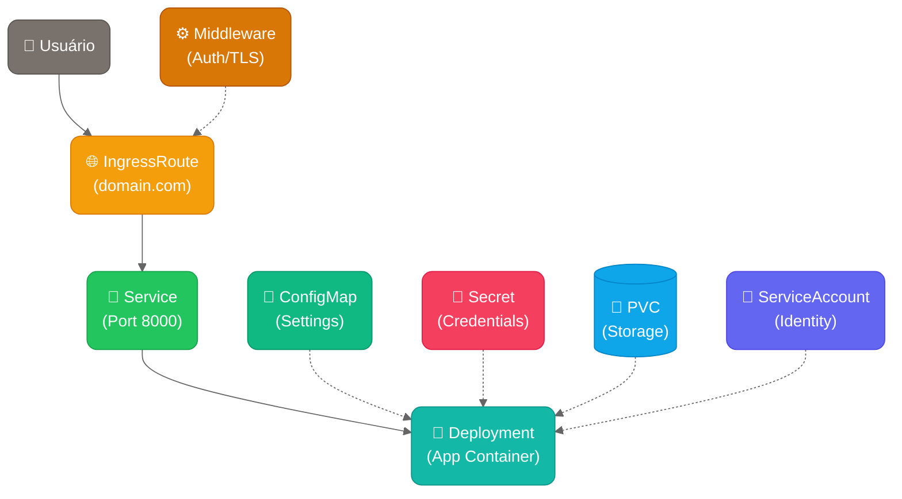
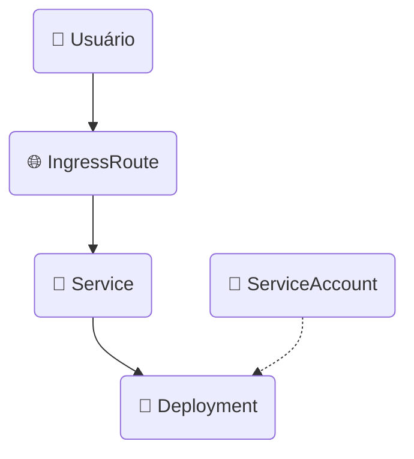
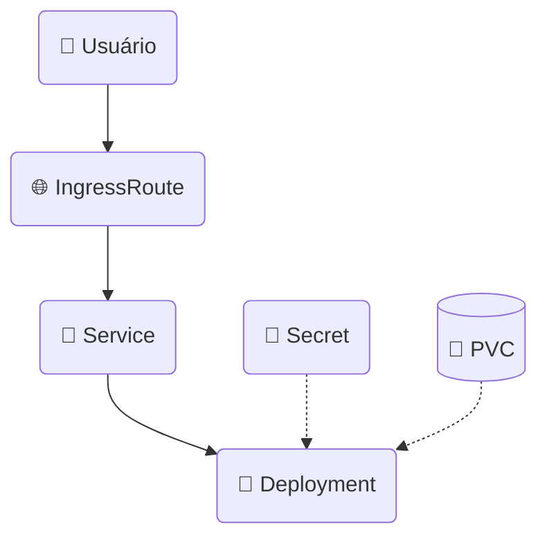

# 📚 **Guia de Documentação de Charts**

> **Padrões práticos** para criar documentação clara e funcional baseada nos charts existentes

---

## 📋 **ÍNDICE**

1. [🎯 Filosofia Prática](#-filosofia-prática)
2. [📖 Estrutura de README](#-estrutura-de-readme)
3. [🎨 Diagramas de Arquitetura](#-diagramas-de-arquitetura)
4. [💬 Comentários no Values.yaml](#-comentários-no-valuesyaml)
5. [🔧 Exemplos Funcionais](#-exemplos-funcionais)
6. [✅ Checklist de Qualidade](#-checklist-de-qualidade)

---

## 🎯 **Filosofia Prática**

### **💡 Princípios Observados nos Charts Existentes**

#### **1. 🚀 Copy-Paste Ready**
- **Comandos funcionam imediatamente** - Sem configuração extra
- **Exemplos práticos** - Desenvolvimento, produção, casos específicos
- **Troubleshooting direto** - Comandos de verificação prontos

#### **2. 📊 Organização Visual Clara**
- **Tabelas para configurações** - Mais fácil de ler que listas
- **Emojis consistentes** - Visual, mas não exagerado
- **Seções bem definidas** - Estrutura previsível

#### **3. 🎓 Educação Progressiva**
- **Básico primeiro** - Instalação rápida
- **Avançado depois** - Configurações específicas
- **Contexto sempre** - Quando e por que usar

#### **4. 🎨 Arquitetura Visual**
- **Diagrama Mermaid obrigatório** - Mostra fluxo completo
- **Cores padronizadas** - Tailwind CSS para consistência
- **Fluxo lógico** - Usuário → Ingress → Service → Deployment

---

## 📖 **Estrutura de README**

### **📋 Template Padrão (baseado nos charts existentes)**

```markdown
# 🎯 [Nome] - Helm Chart Simplificado

**Descrição clara em uma linha** do que o chart faz e seu propósito principal.

> ⚠️ **IMPORTANTE**: Avisos especiais se necessário (como no MinIO sobre versões)

## 🏗️ **Arquitetura**

[DIAGRAMA MERMAID - VER SEÇÃO ESPECÍFICA]

**Recursos criados por este chart:**
- 🌐 **IngressRoute**: Descrição da exposição
- 🔗 **Service**: Função do service
- 🚀 **Deployment**: Container principal
- 🔐 **Secret**: Credenciais necessárias
- 💾 **PVC**: Armazenamento (se aplicável)

**Acessos disponíveis:**
- 📦 **API**: Endpoint da API
- 🖥️ **Console**: Interface web (se aplicável)

## 🚀 **Instalação Rápida**

### **Básica (recomendada)**
```bash
helm install [nome] charts/[nome] \
  --set domain=[exemplo] \
  --set auth.password=minhasenhasegura123 \
  --create-namespace \
  --namespace [nome]
```

### **Com HTTPS**
```bash
helm install [nome] charts/[nome] \
  --set domain=[exemplo] \
  --set auth.password=minhasenhasegura123 \
  --set tls.enabled=true \
  --create-namespace \
  --namespace [nome]
```

### **Para produção**
```bash
helm install [nome] charts/[nome] \
  --set domain=[exemplo] \
  --set auth.password=senha-ultra-segura \
  --set storage.size=100Gi \
  --set storage.storageClass=fast-ssd \
  --create-namespace \
  --namespace [nome]
```

## ⚙️ **Configurações Principais**

| Parâmetro | Descrição | Valor Padrão |
|-----------|-----------|--------------|
| `domain` | URL de acesso | `app.exemplo.com` |
| `auth.password` | **Senha obrigatória** | `""` (deve ser definida) |
| `storage.size` | Tamanho do volume | `30Gi` |
| `tls.enabled` | Habilitar HTTPS automático | `false` |

## 🔧 **Configurações Avançadas**

### **Habilitando configurações avançadas**
```bash
helm install [nome] charts/[nome] \
  --set domain=[exemplo] \
  --set auth.password=senha123 \
  --set advanced.enabled=true \
  --set advanced.[config].param=value \
  --create-namespace \
  --namespace [nome]
```

### **📊 Principais configurações avançadas disponíveis**

#### **🖼️ Configurações de Imagem**
| Parâmetro | Descrição | Padrão |
|-----------|-----------|---------|
| `image.repository` | Repositório da imagem | `[image]` |
| `image.tag` | Tag da imagem | `[version]` |

#### **🩺 Configurações de Health Checks**
| Parâmetro | Descrição | Padrão |
|-----------|-----------|---------|
| `advanced.health.liveness.enabled` | Habilitar liveness probe | `true` |
| `advanced.health.readiness.enabled` | Habilitar readiness probe | `true` |

### **💡 Exemplos de uso avançado**

#### **🚀 Para alta performance**
```bash
helm install [nome]-perf charts/[nome] \
  --set domain=[exemplo] \
  --set auth.password=senha123 \
  --set advanced.enabled=true \
  --set resources.limits.cpu=2000m \
  --set resources.limits.memory=4Gi \
  --create-namespace \
  --namespace [nome]
```

## 🔍 **Verificação da Instalação**

```bash
# Verificar pods
kubectl get pods -n [namespace]

# Verificar serviços
kubectl get svc -n [namespace]

# Verificar IngressRoutes
kubectl get ingressroute -n [namespace]

# Verificar PVC
kubectl get pvc -n [namespace]
```

## 📦 **Teste Funcional**

```bash
# Testar conectividade básica
[comandos específicos do chart]
```

## 🚨 **Troubleshooting**

### **Problemas Comuns**

#### **❌ Pod não inicia**
```bash
kubectl describe pod -n [namespace]
kubectl logs -n [namespace] deployment/[nome]
```

#### **❌ Não consegue acessar aplicação**
```bash
kubectl get ingressroute -n [namespace]
kubectl describe ingressroute -n [namespace]
```

**📚 Guia completo:** [TROUBLESHOOTING.md](../docs/TROUBLESHOOTING.md)

### **🎯 Regras Essenciais para READMEs:**

1. **🚀 Instalação Rápida SEMPRE no topo** - Comando que funciona em 30 segundos
2. **📊 Tabelas para configurações** - Mais legível que listas
3. **🎨 Diagrama obrigatório** - Arquitetura visual clara
4. **🔧 Seção avançada separada** - Para não confundir iniciantes
5. **📋 Exemplos práticos** - Pelo menos 3 cenários
6. **🔍 Verificação incluída** - Como validar se funcionou

---

## 🎨 **Diagramas de Arquitetura**

Todos os charts devem incluir um diagrama Mermaid mostrando o fluxo de recursos. Use o padrão de cores abaixo para consistência visual:

### **🎨 Cores por Tipo de Recurso**

Baseado no [Tailwind CSS](https://tailwindcss.com/docs/colors) para modernidade e consistência:

| Recurso | Cor | Código Tailwind | Hex | Uso |
|---------|-----|----------------|-----|-----|
| **IngressRoute/Ingress** | 🟡 Amber | `amber-500` | `fill:#f59e0b,stroke:#d97706,color:#fff` | Entrada externa |
| **Service** | 🟢 Green | `green-500` | `fill:#22c55e,stroke:#16a34a,color:#fff` | Conectividade interna |
| **Deployment/Pod** | 🟦 Teal | `teal-500` | `fill:#14b8a6,stroke:#0d9488,color:#fff` | Workloads |
| **ConfigMap** | 🟢 Emerald | `emerald-500` | `fill:#10b981,stroke:#059669,color:#fff` | Configurações |
| **Secret** | 🌹 Rose | `rose-500` | `fill:#f43f5e,stroke:#e11d48,color:#fff` | Credenciais |
| **PVC/Storage** | 🔵 Sky | `sky-500` | `fill:#0ea5e9,stroke:#0284c7,color:#fff` | Armazenamento |
| **ServiceAccount** | 🟣 Indigo | `indigo-500` | `fill:#6366f1,stroke:#4f46e5,color:#fff` | Identidade |
| **Middleware** | 🟡 Amber | `amber-700` | `fill:#d97706,stroke:#b45309,color:#fff` | Processamento |
| **User/External** | ⚫ Stone | `stone-500` | `fill:#78716c,stroke:#57534e,color:#fff` | Usuário/Externo |

### **📐 Template de Diagrama**



### **💡 Dicas para Diagramas**
- **Cores**: Use sempre [Tailwind CSS](https://tailwindcss.com/docs/colors) conforme tabela acima
- **Bordas**: Todos os recursos com bordas arredondadas `(recurso)` exceto PVC
- **PVC**: Sempre formato de banco de dados `[("💾 PVC<br/>(Storage)")]`
- **Fluxo principal**: Setas sólidas (usuário → ingress → service → deployment)
- **Dependências**: Setas pontilhadas (-.->) para configs, secrets, storage
- **Ícones**: Use emojis para melhor visualização (👤 🌐 🔗 🚀 📝 🔐 💾)
- **Agrupamento**: Mantenha recursos relacionados próximos
- **Simplicidade**: Máximo 8-10 recursos por diagrama

### **🎯 Exemplos Práticos**

#### **Aplicação Simples (como Bridge)**


#### **Aplicação com Dados (como MinIO/Redis)**


---

## 💬 **Comentários no Values.yaml**

### **📋 Estrutura Padrão (baseada nos charts existentes)**

```yaml
# 🎯 [Nome do Chart] - Configurações Helm Chart
# Descrição breve do que o chart faz

# =============================================================================
# 🚀 CONFIGURAÇÃO ESSENCIAL
# =============================================================================
# Estas são as configurações que 80% dos usuários vão alterar

# Domínio onde a aplicação será acessível
# Exemplo: app.meusite.com, api.empresa.com
domain: "app.exemplo.com"

# Configuração da imagem Docker
image:
  repository: nginx          # Repositório da imagem
  tag: "1.21"               # Versão/tag da imagem
  pullPolicy: IfNotPresent  # Política de download (IfNotPresent, Always, Never)

# Recursos de CPU e Memória
resources:
  cpu: "100m"     # CPU: 100m = 0.1 core, 1000m = 1 core
  memory: "128Mi" # Memória: 128Mi = 128 Megabytes, 1Gi = 1024Mi

# =============================================================================  
# ⚡ FUNCIONALIDADES OPCIONAIS
# =============================================================================
# Funcionalidades que podem ser habilitadas conforme necessário

# Configuração TLS/HTTPS
tls:
  enabled: false # Habilita HTTPS automático

# Configuração de autenticação
auth:
  enabled: false    # Habilita autenticação básica
  username: "admin" # Usuário padrão
  password: ""      # Senha (obrigatória se auth habilitado)

# Armazenamento persistente
storage:
  size: "10Gi"           # Tamanho do volume
  storageClass: ""       # Classe de armazenamento (vazio = padrão)

# =============================================================================
# 🔧 CONFIGURAÇÃO AVANÇADA (OPCIONAL)
# =============================================================================
# Configurações para usuários experientes (raramente alteradas)

# Sobrescrever nomes dos recursos
nameOverride: ""     # Sobrescreve o nome do chart
fullnameOverride: "" # Sobrescreve o nome completo dos recursos

# Componente para identificação nos labels
component: "application" # Tipo de componente (application, database, cache)

# Configurações extremamente avançadas (apenas se necessário)
advanced:
  enabled: false # Habilita seção de configurações avançadas

  # ⚠️ Configurações abaixo só são aplicadas se advanced.enabled=true

  # Configurações de deployment
  deployment:
    replicas: 1
    strategy:
      type: RollingUpdate

  # Configurações do service
  service:
    type: ClusterIP
    annotations: {}

  # Configurações de segurança
  security:
    runAsUser: 1000
    runAsGroup: 1000
    fsGroup: 1000

  # Variáveis de ambiente personalizadas
  env: []
  # Exemplo:
  # env:
  #   - name: CUSTOM_VAR
  #     value: "custom-value"
```

### **🎯 Regras para Comentários**

1. **📋 Seções claramente divididas** - ESSENCIAL, OPCIONAL, AVANÇADO
2. **💬 Explicar quando usar** - Não apenas o que faz
3. **🎯 Exemplos práticos** - Valores reais nos comentários
4. **⚠️ Alertas importantes** - Configurações críticas destacadas
5. **🎓 Educação progressiva** - Do simples ao complexo

---

## 🔧 **Exemplos Funcionais**

### **📋 Comandos que Sempre Funcionam**

#### **Desenvolvimento Rápido**
```bash
# Template para qualquer chart
helm install dev charts/[nome] \
  --set domain=app.local \
  --create-namespace \
  --namespace dev
```

#### **Produção Básica**
```bash
# Template com TLS e autenticação
helm install prod charts/[nome] \
  --set domain=app.empresa.com \
  --set tls.enabled=true \
  --set auth.enabled=true \
  --set auth.password=senha-segura \
  --create-namespace \
  --namespace prod
```

#### **Alta Performance**
```bash
# Template para cargas altas
helm install perf charts/[nome] \
  --set domain=app.empresa.com \
  --set resources.limits.cpu=2000m \
  --set resources.limits.memory=4Gi \
  --set storage.size=100Gi \
  --set storage.storageClass=fast-ssd \
  --create-namespace \
  --namespace prod
```

### **📋 Verificação Padrão**

```bash
# Comandos universais para qualquer chart
kubectl get pods -n [namespace]
kubectl get svc -n [namespace]
kubectl get ingressroute -n [namespace]
kubectl get pvc -n [namespace]

# Debug universal
kubectl describe pod -n [namespace] -l app.kubernetes.io/name=[chart]
kubectl logs -n [namespace] deployment/[release]-[chart]
```

---

## ✅ **Checklist de Qualidade**

### **📋 Para READMEs de Charts**

- [ ] **🚀 Instalação rápida no topo** - Comando funcionando em 30 segundos
- [ ] **🎨 Diagrama Mermaid presente** - Cores padronizadas Tailwind
- [ ] **📊 Tabelas de configuração** - Parâmetros organizados visualmente
- [ ] **🔧 Seção avançada separada** - Não confundir iniciantes
- [ ] **🔍 Comandos de verificação** - Como validar se funcionou
- [ ] **📋 Pelo menos 3 exemplos** - Básico, produção, específico
- [ ] **🚨 Troubleshooting básico** - Problemas mais comuns
- [ ] **📏 Tamanho razoável** - Não mais que 400 linhas

### **📝 Para Values.yaml**

- [ ] **📋 Seções bem definidas** - ESSENCIAL → OPCIONAL → AVANÇADO
- [ ] **💬 Comentários educativos** - Explicar quando usar, não só o que é
- [ ] **🎯 Exemplos nos comentários** - Valores práticos
- [ ] **⚠️ Alertas importantes** - Configurações críticas destacadas
- [ ] **🔧 advanced.enabled=false** - Configurações avançadas opcionais
- [ ] **📊 Defaults funcionais** - Valores que funcionam sem configuração

### **🎨 Para Diagramas**

- [ ] **🎨 Cores Tailwind CSS** - Seguir tabela padrão
- [ ] **📐 Fluxo lógico** - Usuário → Ingress → Service → Deployment
- [ ] **🔗 Dependências pontilhadas** - Configs, secrets, storage
- [ ] **🎯 Máximo 10 recursos** - Não sobrecarregar visualmente
- [ ] **📱 Bordas arredondadas** - Todos exceto PVC
- [ ] **💾 PVC formato especial** - `[("💾 PVC")]`

### **🔧 Para Exemplos**

- [ ] **✅ Comandos testados** - Funcionam realmente
- [ ] **📋 Cenários realistas** - Dev, produção, performance
- [ ] **🔍 Verificação incluída** - Como confirmar sucesso
- [ ] **📝 Contexto claro** - Quando usar cada exemplo
- [ ] **🚀 Copy-paste ready** - Sem configuração adicional necessária

---

## 🎯 **RESUMO EXECUTIVO**

### **✅ Padrão Observado nos Charts Existentes:**
1. **🚀 FUNCIONAL**: Comandos que funcionam imediatamente
2. **📊 ORGANIZADO**: Tabelas e seções visuais claras  
3. **🎨 VISUAL**: Diagramas Mermaid com cores padronizadas
4. **🎓 PROGRESSIVO**: Básico → Avançado sem confundir

### **📋 Estrutura Testada e Aprovada:**
- **README**: Instalação rápida → Arquitetura → Configurações → Avançado
- **Values**: ESSENCIAL → OPCIONAL → AVANÇADO
- **Diagramas**: Tailwind CSS + fluxo lógico
- **Exemplos**: Dev, produção, performance

### **🎯 Objetivo Final:**
**Documentação que permite usar charts em produção em menos de 5 minutos, não documentação que impressiona mas não funciona!**

---

**💡 Baseado nos padrões reais dos charts Bridge, MinIO e Redis - testado e aprovado em produção!** 