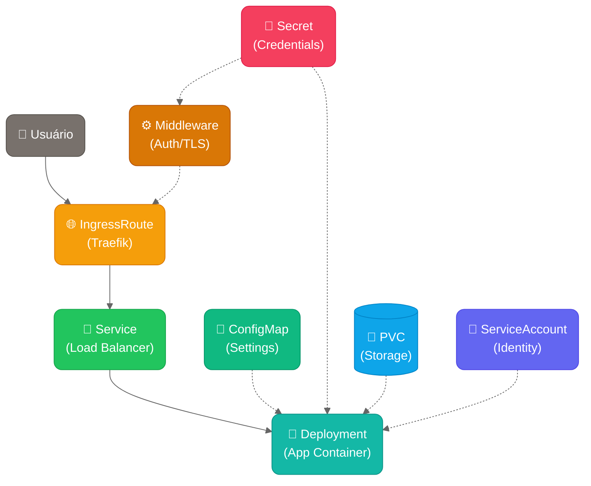

# 📋 Chart Guidelines - Padrões para Charts Simplificados

## 🎯 **OBJETIVO**

Este documento define os padrões para criação de charts Helm **simples e amigáveis** para pessoas aprendendo Kubernetes. O foco é na **experiência do usuário iniciante**, mantendo a simplicidade sem comprometer a funcionalidade.

## 🏗️ **ESTRUTURA DE UM CHART**

### **Diretório Base**
```
new-charts/nome-do-chart/
├── Chart.yaml              # Metadados do chart
├── values.yaml             # Configurações (SIMPLES)
├── README.md               # Documentação focada no usuário
├── templates/
│   ├── deployment.yaml     # Aplicação principal
│   ├── service.yaml        # Exposição interna
│   ├── ingressroute.yaml   # Exposição externa (Traefik)
│   ├── configmap.yaml      # Configurações (se necessário)
│   ├── secret.yaml         # Credenciais (se necessário)
│   └── rbac.yaml           # Permissões (se necessário)
└── .helmignore             # Arquivos a ignorar
```

## 📝 **PADRÕES OBRIGATÓRIOS**

### **1. Chart.yaml**
```yaml
apiVersion: v2
name: nome-do-chart
description: Descrição clara do que o chart faz
type: application
version: 0.1.0
appVersion: "1.0.0"
keywords:
  - kubernetes
  - web
  - application
home: https://github.com/seu-usuario/charts
sources:
  - https://github.com/aplicacao-oficial
maintainers:
  - name: Seu Nome
    email: seu@email.com
```

### **2. Labels Padrão**
**TODOS** os recursos devem usar estas labels:
```yaml
metadata:
  labels:
    app.kubernetes.io/name: {{ .Chart.Name }}
    app.kubernetes.io/instance: {{ .Release.Name }}
    app.kubernetes.io/version: {{ .Chart.AppVersion | quote }}
    app.kubernetes.io/component: {{ .Values.component | default "application" }}
    app.kubernetes.io/part-of: {{ .Chart.Name }}
    app.kubernetes.io/managed-by: {{ .Release.Service }}
```

### **3. Nomes e Labels Diretos (SEM _helpers.tpl)**
Para manter a simplicidade máxima, **NÃO usamos _helpers.tpl**. Tudo é direto nos templates:

**Nome dos recursos:**
```yaml
name: {{ .Release.Name }}-{{ .Chart.Name }}
```

**Labels padrão (copiar e colar em todos os recursos):**
```yaml
labels:
  app.kubernetes.io/name: {{ .Chart.Name }}
  app.kubernetes.io/instance: {{ .Release.Name }}
  app.kubernetes.io/version: {{ .Chart.AppVersion | quote }}
  app.kubernetes.io/component: {{ .Values.component | default "application" }}
  app.kubernetes.io/part-of: {{ .Chart.Name }}
  app.kubernetes.io/managed-by: {{ .Release.Service }}
```

**Seletores (para Deployment e Service):**
```yaml
selector:
  matchLabels:
    app.kubernetes.io/name: {{ .Chart.Name }}
    app.kubernetes.io/instance: {{ .Release.Name }}
```

## ⚙️ **PADRÕES DO VALUES.YAML**

### **Estrutura Obrigatória**
```yaml
# =============================================================================
# CONFIGURAÇÃO BÁSICA (que o usuário vai alterar)
# =============================================================================

# Domínio/URL onde a aplicação será acessível
domain: "app.exemplo.com"

# Configuração da Imagem
image:
  repository: "nginx"
  tag: "1.21"
  pullPolicy: IfNotPresent

# Recursos de CPU e Memória
resources:
  cpu: "100m"
  memory: "128Mi"
  
# =============================================================================  
# FUNCIONALIDADES OPCIONAIS
# =============================================================================

# Autenticação Básica
auth:
  enabled: false
  username: ""
  password: ""

# TLS/HTTPS
tls:
  enabled: false
  
# =============================================================================
# CONFIGURAÇÃO AVANÇADA (raramente alterada)
# =============================================================================

# Sobrescrever nomes
nameOverride: ""
fullnameOverride: ""

# Componente (para labels)
component: "application"

# Configurações avançadas (apenas se necessário)
advanced:
  enabled: false
  # Configurações complexas aqui
```

### **Princípios para Values**

1. **Topo = Essencial**: O que 80% dos usuários vão alterar
2. **Meio = Opcional**: Funcionalidades que podem ser habilitadas  
3. **Bottom = Avançado**: Configurações para usuários experientes
4. **Valores Sensatos**: Defaults que funcionam out-of-the-box
5. **Documentação Inline**: Comentários explicando cada seção

## 🔧 **PADRÕES DE TEMPLATES**

### **1. Deployment.yaml**
```yaml
apiVersion: apps/v1
kind: Deployment
metadata:
  name: {{ .Release.Name }}-{{ .Chart.Name }}
  namespace: {{ .Release.Namespace }}
  labels:
    app.kubernetes.io/name: {{ .Chart.Name }}
    app.kubernetes.io/instance: {{ .Release.Name }}
    app.kubernetes.io/version: {{ .Chart.AppVersion | quote }}
    app.kubernetes.io/component: {{ .Values.component | default "application" }}
    app.kubernetes.io/part-of: {{ .Chart.Name }}
    app.kubernetes.io/managed-by: {{ .Release.Service }}
spec:
  replicas: {{ .Values.replicas | default 1 }}
  selector:
    matchLabels:
      app.kubernetes.io/name: {{ .Chart.Name }}
      app.kubernetes.io/instance: {{ .Release.Name }}
  template:
    metadata:
      labels:
        app.kubernetes.io/name: {{ .Chart.Name }}
        app.kubernetes.io/instance: {{ .Release.Name }}
    spec:
      containers:
      - name: {{ .Chart.Name }}
        image: "{{ .Values.image.repository }}:{{ .Values.image.tag }}"
        imagePullPolicy: {{ .Values.image.pullPolicy }}
        # ... resto da configuração
```

### **2. Service.yaml**
```yaml
apiVersion: v1
kind: Service
metadata:
  name: {{ .Release.Name }}-{{ .Chart.Name }}
  namespace: {{ .Release.Namespace }}
  labels:
    app.kubernetes.io/name: {{ .Chart.Name }}
    app.kubernetes.io/instance: {{ .Release.Name }}
    app.kubernetes.io/version: {{ .Chart.AppVersion | quote }}
    app.kubernetes.io/component: {{ .Values.component | default "application" }}
    app.kubernetes.io/part-of: {{ .Chart.Name }}
    app.kubernetes.io/managed-by: {{ .Release.Service }}
spec:
  type: ClusterIP
  ports:
  - port: 80
    targetPort: http
    protocol: TCP
    name: http
  selector:
    app.kubernetes.io/name: {{ .Chart.Name }}
    app.kubernetes.io/instance: {{ .Release.Name }}
```

### **3. IngressRoute.yaml (Traefik)**
```yaml
{{- if .Values.domain }}
apiVersion: traefik.io/v1alpha1
kind: IngressRoute
metadata:
  name: {{ .Release.Name }}-{{ .Chart.Name }}
  namespace: {{ .Release.Namespace }}
  labels:
    app.kubernetes.io/name: {{ .Chart.Name }}
    app.kubernetes.io/instance: {{ .Release.Name }}
    app.kubernetes.io/version: {{ .Chart.AppVersion | quote }}
    app.kubernetes.io/component: {{ .Values.component | default "application" }}
    app.kubernetes.io/part-of: {{ .Chart.Name }}
    app.kubernetes.io/managed-by: {{ .Release.Service }}
spec:
  entryPoints:
  - web
  {{- if .Values.tls.enabled }}
  - websecure
  {{- end }}
  routes:
  - match: Host(`{{ .Values.domain }}`)
    kind: Rule
    services:
    - name: {{ .Release.Name }}-{{ .Chart.Name }}
      port: 80
    {{- if .Values.auth.enabled }}
    middlewares:
    - name: {{ .Release.Name }}-{{ .Chart.Name }}-auth
    {{- end }}
  {{- if .Values.tls.enabled }}
  tls:
    certResolver: default
  {{- end }}
{{- end }}
```

## 📖 **PADRÕES DE DOCUMENTAÇÃO**

### **🎨 Diagramas de Arquitetura**

Todos os charts devem incluir um diagrama Mermaid mostrando o fluxo de recursos. Use o padrão de cores abaixo para consistência visual:


#### **🎨 Cores por Tipo de Recurso**

Baseado no [Tailwind CSS](https://tailwindcss.com/docs/colors) peso 600 para modernidade e consistência:

| Recurso | Cor | Código Tailwind | Hex | Uso |
|---------|-----|----------------|-----|-----|
| **IngressRoute/Ingress** | 🟡 Amber | `amber-500` | `fill:#f59e0b,stroke:#d97706,color:#fff` | Entrada externa |
| **Service** | 🟢 Green | `green-500` | `fill:#22c55e,stroke:#16a34a,color:#fff` | Conectividade interna |
| **Deployment/Pod** | 🟦 Teal | `teal-500` | `fill:#14b8a6,stroke:#0d9488,color:#fff` | Workloads |
| **ConfigMap** | 🟢 Emerald | `emerald-500` | `fill:#10b981,stroke:#059669,color:#fff` | Configurações |
| **Secret** | 🌹 Rose | `rose-500` | `fill:#f43f5e,stroke:#e11d48,color:#fff` | Credenciais |
| **PVC/Storage** | 🔵 Sky | `sky-500` | `fill:#0ea5e9,stroke:#0284c7,color:#fff` | Armazenamento |
| **ServiceAccount** | 🟣 Indigo | `indigo-500` | `fill:#6366f1,stroke:#4f46e5,color:#fff` | Identidade |
| **Middleware** | 🟡 Amber | `amber-700` | `fill:#d97706,stroke:#b45309,color:#fff` | Processamento |
| **User/External** | ⚫ Stone | `stone-500` | `fill:#78716c,stroke:#57534e,color:#fff` | Usuário/Externo |

#### **📐 Padrão de Diagrama**



#### **💡 Dicas para Diagramas**
- **Cores**: Use sempre [Tailwind CSS](https://tailwindcss.com/docs/colors) peso 600 conforme tabela acima
- **Bordas**: Todos os recursos com bordas arredondadas `(recurso)` exceto PVC
- **PVC**: Sempre formato de banco de dados `[("💾 PVC<br/>(Storage)")]`
- **Fluxo principal**: Setas sólidas (usuário → ingress → service → deployment)
- **Dependências**: Setas pontilhadas (-.->) para configs, secrets, storage
- **Ícones**: Use emojis para melhor visualização (👤 🌐 🔗 🚀 📝 🔐 💾)
- **Agrupamento**: Mantenha recursos relacionados próximos
- **Simplicidade**: Máximo 8-10 recursos por diagrama

### **README.md Estrutura**
```markdown
# Nome do Chart

Breve descrição do que o chart faz.

## 🚀 Instalação Rápida

### Básica
```bash
helm install meu-app new-charts/nome-do-chart \
  --set domain=meuapp.exemplo.com
```

### Com funcionalidades
```bash
helm install meu-app new-charts/nome-do-chart \
  --set domain=meuapp.exemplo.com \
  --set auth.enabled=true \
  --set auth.username=admin \
  --set auth.password=senha123
```

## ⚙️ Configurações

| Parâmetro | Descrição | Padrão |
|-----------|-----------|--------|
| `domain` | Domínio da aplicação | `""` |
| `image.tag` | Versão da imagem | `"latest"` |

## 🔧 Exemplos

[Exemplos práticos aqui]

## 🛠️ Troubleshooting

[Problemas comuns e soluções]
```

## ✅ **CHECKLIST DE QUALIDADE**

Antes de considerar um chart pronto:

### **Funcionalidade**
- [ ] Instala com `helm install nome new-charts/chart`
- [ ] Funciona com configuração padrão
- [ ] Domínio customizável via `--set domain=`
- [ ] Recursos customizáveis via `--set resources.*`

### **Usabilidade**
- [ ] Values.yaml tem estrutura clara (básico → opcional → avançado)
- [ ] Todos os valores têm defaults sensatos
- [ ] README tem exemplos práticos
- [ ] Comandos de instalação são simples

### **Padronização**
- [ ] Labels seguem padrão kubernetes.io
- [ ] Nomes dos recursos seguem padrão `{{ .Release.Name }}-{{ .Chart.Name }}`
- [ ] Naming conventions seguidas
- [ ] Templates seguem estrutura padrão

### **Qualidade**
- [ ] `helm lint` passa sem erros
- [ ] `helm template` gera YAML válido
- [ ] Testes básicos incluídos
- [ ] Documentação completa

## 🎯 **EXPERIÊNCIA DO USUÁRIO ALVO**

### **Cenário Ideal**
```bash
# Usuário iniciante quer instalar uma aplicação
helm install minha-app new-charts/bridge --set domain=bridge.meusite.com

# Resultado: 
# ✅ Aplicação rodando
# ✅ Acessível via bridge.meusite.com  
# ✅ Configuração intuitiva
# ✅ Documentação clara
```

### **Comandos Típicos**
```bash
# Desenvolvimento
helm install app new-charts/chart --set domain=app.localhost

# Produção simples
helm install app new-charts/chart --set domain=app.empresa.com

# Produção com segurança
helm install app new-charts/chart \
  --set domain=app.empresa.com \
  --set tls.enabled=true \
  --set auth.enabled=true \
  --set auth.username=admin \
  --set auth.password=$(openssl rand -base64 12)
```

---

**Este documento deve ser consultado sempre** antes de criar ou modificar um chart na pasta `new-charts/`. 

# 📚 Guidelines para Charts Simplificados

## 🎯 **Objetivo**
Criar charts Helm **simples e amigáveis** para pessoas aprendendo Kubernetes, priorizando clareza sobre complexidade.

## 📁 **Estrutura Base**

```
new-charts/[chart-name]/
├── Chart.yaml              # ✅ OBRIGATÓRIO
├── values.yaml             # ✅ OBRIGATÓRIO
├── README.md               # ✅ OBRIGATÓRIO
└── templates/              # ✅ OBRIGATÓRIO
    ├── deployment.yaml     # Aplicação principal (se aplicável)
    ├── service.yaml        # Exposição interna (se aplicável)
    ├── ingressroute.yaml   # Exposição externa (se aplicável)
    ├── secret.yaml         # Credenciais (se necessário)
    ├── configmap.yaml      # Configurações (se necessário)
    ├── pvc.yaml            # Armazenamento (se necessário)
    └── serviceaccount.yaml # Permissões (se necessário)
```

**📋 IMPORTANTE:** Nem todos os charts implementam todos os recursos. O que importa é que **os recursos implementados sigam os padrões**.

**❌ PROIBIDO**: `_helpers.tpl` - Mantemos templates diretos e legíveis

## 🏷️ **Labels Obrigatórias**

**TODOS os recursos** devem ter estas 6 labels:

```yaml
labels:
  app.kubernetes.io/name: "{{ .Chart.Name }}"
  app.kubernetes.io/instance: "{{ .Release.Name }}"
  app.kubernetes.io/version: {{ .Chart.AppVersion | quote }}
  app.kubernetes.io/component: {{ .Values.component | default "application" | quote }}
  app.kubernetes.io/part-of: "{{ .Chart.Name }}"
  app.kubernetes.io/managed-by: "{{ .Release.Service }}"
```

## 📛 **Nomenclatura Padrão**

### **Nome dos Recursos**
```yaml
name: "{{ .Release.Name }}-{{ .Chart.Name }}"
```

### **Namespace**
```yaml
namespace: "{{ .Release.Namespace }}"
```

### **Seletores**
```yaml
selector:
  matchLabels:
    app.kubernetes.io/name: "{{ .Chart.Name }}"
    app.kubernetes.io/instance: "{{ .Release.Name }}"
```

## 📝 **Estrutura values.yaml**

Seguir sempre esta ordem:

```yaml
# 🚀 CONFIGURAÇÃO ESSENCIAL
domain: "app.exemplo.com"
image: {...}
resources: {...}

# ⚡ FUNCIONALIDADES OPCIONAIS  
auth: {...}
tls: {...}
persistence: {...}

# 🔧 CONFIGURAÇÃO AVANÇADA (OPCIONAL)
# ⚠️ Esta seção pode ser omitida por padrão do values.yaml
# Só é aplicada nos templates se advanced.enabled=true for definido
advanced:
  enabled: false           # Habilita configurações avançadas nos templates
  # Configurações específicas aqui
component: "application"
```

## 📦 **Templates Padrão**

### **Deployment**
- Nome: `{{ .Release.Name }}-{{ .Chart.Name }}`
- Labels: 6 obrigatórias no metadata **E** no template
- Selector: `app.kubernetes.io/name` + `app.kubernetes.io/instance`
- Resources: Sempre configuráveis via `{{ .Values.resources }}`
- Health checks: Opcional

### **Service**
- Nome: `{{ .Release.Name }}-{{ .Chart.Name }}`
- Type: `ClusterIP` (padrão)
- Selector: `app.kubernetes.io/name` + `app.kubernetes.io/instance`
- Port: `80` → `targetPort: http`

### **IngressRoute (Traefik)**
- Nome: `{{ .Release.Name }}-{{ .Chart.Name }}`
- Match: `Host(\`{{ .Values.domain }}\`)`
- Service: `{{ .Release.Name }}-{{ .Chart.Name }}`
- TLS: Condicional via `{{ .Values.tls.enabled }}`

### **Resources Condicionais**
Use `{{- if .Values.feature.enabled }}` para:
- Secret (auth)
- Middleware (auth)
- PVC (persistence)
- ServiceAccount (RBAC)

## 🔧 **Configurações Avançadas Opcionais**

### **Filosofia**
- **Por padrão**: O `values.yaml` deve ser **limpo e simples**
- **Quando necessário**: Usuário adiciona `advanced.enabled=true`
- **Nos templates**: Use condicionais `{{- if .Values.advanced.enabled }}`

### **Estrutura nos Templates**
```yaml
# Labels principais (sempre aplicadas)
labels:
  app.kubernetes.io/name: "{{ .Chart.Name }}"
  # ... outras labels obrigatórias

# Labels extras (apenas se advanced.enabled)
{{- if .Values.advanced.enabled }}
{{- with .Values.advanced.labels }}
{{- toYaml . | nindent 4 }}
{{- end }}
{{- end }}

# Annotations (apenas se advanced.enabled)  
{{- if .Values.advanced.enabled }}
{{- with .Values.advanced.annotations }}
annotations:
  {{- toYaml . | nindent 4 }}
{{- end }}
{{- end }}
```

### **Exemplo no Values.yaml**
```yaml
# Values.yaml simples (padrão)
domain: "app.exemplo.com"
image:
  repository: nginx
  tag: "1.21"

# Usuário avançado pode adicionar:
advanced:
  enabled: true
  annotations:
    custom.io/annotation: "value"
  labels:
    custom.io/label: "value"
```

## 💬 **Comentários Educativos**

```yaml
# 🚀 CONFIGURAÇÃO ESSENCIAL
# Configurações básicas necessárias para funcionamento

# Domínio onde a aplicação será acessível
# Exemplo: app.meusite.com
domain: "app.exemplo.com"
```

## ✅ **Checklist de Qualidade**

### **📋 Validação Básica**
- [ ] **Labels**: Todas as 6 labels kubernetes.io em TODOS os recursos
- [ ] **Nomes**: `{{ .Release.Name }}-{{ .Chart.Name }}` consistente
- [ ] **Values**: Estrutura Essencial → Opcional → Avançado
- [ ] **Comentários**: Explicativos e educativos no values.yaml
- [ ] **Defaults**: Funcionam out-of-the-box
- [ ] **README**: Documentação clara com exemplos

### **🧪 Validação de Testes**
- [ ] **Helm Lint**: `helm lint` passa sem erros
- [ ] **Template**: `helm template` gera YAML válido  
- [ ] **Dry Run**: `kubectl apply --dry-run=client` funciona
- [ ] **Helm Test**: Templates de teste implementados
- [ ] **Install**: Chart instala corretamente
- [ ] **Upgrade**: Chart faz upgrade sem problemas
- [ ] **Uninstall**: Remove todos os recursos

### **🎯 Validação de Experiência**
- [ ] **Comando Básico**: `--set domain=app.com` funciona
- [ ] **Features**: Todas as funcionalidades testadas
- [ ] **Health Checks**: Implementados quando apropriado
- [ ] **Troubleshooting**: Documentado no TROUBLESHOOTING.md

## 🧪 **ESTRATÉGIAS DE TESTE E VALIDAÇÃO**

### **📋 Filosofia de Testes**
- **Teste cedo e frequentemente**: Validar a cada mudança
- **Automatização total**: Scripts para CI/CD
- **Múltiplas camadas**: Sintaxe → Funcionalidade → Integração
- **Feedback rápido**: Falhas devem ser identificadas rapidamente

---

### **🔍 1. VALIDAÇÃO DE SINTAXE**

#### **Helm Lint (Obrigatório)**
```bash
# Validar sintaxe básica do chart
helm lint new-charts/[nome-do-chart]

# Validar com diferentes values
helm lint new-charts/[nome-do-chart] \
  --values new-charts/[nome-do-chart]/values.yaml

# Validar com configurações específicas
helm lint new-charts/[nome-do-chart] \
  --set domain=test.com \
  --set auth.enabled=true
```

**Critérios de Aceite:**
- ✅ Zero erros de lint
- ✅ Zero warnings críticos
- ✅ Todas as combinações de values testadas

---

#### **Template Validation**
```bash
# Gerar templates sem instalar
helm template test-release new-charts/[nome-do-chart] \
  --set domain=test.exemplo.com

# Validar YAML gerado
helm template test-release new-charts/[nome-do-chart] \
  --set domain=test.exemplo.com | kubectl apply --dry-run=client -f -

# Testar cenários específicos
helm template test-release new-charts/[nome-do-chart] \
  --set domain=test.exemplo.com \
  --set auth.enabled=true \
  --set tls.enabled=true \
  --set persistence.enabled=true
```

---

### **🧪 2. HELM TESTS (Testes Funcionais)**

#### **Estrutura de Test Templates**
Criar arquivo `templates/tests/test-pod.yaml`:

```yaml
apiVersion: v1
kind: Pod
metadata:
  name: "{{ .Release.Name }}-{{ .Chart.Name }}-test"
  namespace: "{{ .Release.Namespace }}"
  labels:
    app.kubernetes.io/name: "{{ .Chart.Name }}"
    app.kubernetes.io/instance: "{{ .Release.Name }}"
    app.kubernetes.io/version: {{ .Chart.AppVersion | quote }}
    app.kubernetes.io/component: "test"
    app.kubernetes.io/part-of: "{{ .Chart.Name }}"
    app.kubernetes.io/managed-by: "{{ .Release.Service }}"
  annotations:
    "helm.sh/hook": test
    "helm.sh/hook-weight": "1"
    "helm.sh/hook-delete-policy": before-hook-creation,hook-succeeded
spec:
  restartPolicy: Never
  containers:
  - name: test
    image: curlimages/curl:latest
    command:
    - /bin/sh
    - -c
    - |
      set -e
      echo "🧪 Iniciando testes do {{ .Chart.Name }}..."
      
      # Teste 1: Verificar se service está respondendo
      echo "✅ Testando conectividade com service..."
      curl -f http://{{ .Release.Name }}-{{ .Chart.Name }}:80/ || exit 1
      
      {{- if .Values.domain }}
      # Teste 2: Verificar se IngressRoute foi criado
      echo "✅ Verificando IngressRoute..."
      nslookup {{ .Values.domain }} || echo "⚠️  DNS não configurado para {{ .Values.domain }}"
      {{- end }}
      
      {{- if .Values.auth.enabled }}
      # Teste 3: Verificar autenticação
      echo "✅ Testando autenticação..."
      curl -f http://{{ .Release.Name }}-{{ .Chart.Name }}:80/ && exit 1 || echo "✅ Auth funcionando"
      {{- end }}
      
      {{- if .Values.healthcheck.enabled }}
      # Teste 4: Verificar health endpoints
      echo "✅ Testando health checks..."
      {{- if .Values.healthcheck.liveness.enabled }}
      curl -f http://{{ .Release.Name }}-{{ .Chart.Name }}:80{{ .Values.healthcheck.liveness.path | default "/health" }} || exit 1
      {{- end }}
      {{- if .Values.healthcheck.readiness.enabled }}
      curl -f http://{{ .Release.Name }}-{{ .Chart.Name }}:80{{ .Values.healthcheck.readiness.path | default "/ready" }} || exit 1
      {{- end }}
      {{- end }}
      
      echo "🎉 Todos os testes passaram!"
```

#### **Executar Helm Tests**
```bash
# Instalar chart
helm install test-release new-charts/[nome-do-chart] \
  --set domain=test.exemplo.com

# Executar testes
helm test test-release

# Ver logs dos testes
kubectl logs -l app.kubernetes.io/component=test

# Limpar após testes
helm uninstall test-release
```

---

### **⚙️ 3. CHART TESTING (ct)**

#### **Instalação**
```bash
# Instalar chart-testing
curl -sSL https://github.com/helm/chart-testing/releases/download/v3.10.1/chart-testing_3.10.1_linux_amd64.tar.gz | tar xz
sudo mv ct /usr/local/bin/
```

#### **Configuração (.github/ct.yaml)**
```yaml
# Configuração do chart-testing
remote: origin
target-branch: main
chart-dirs:
  - new-charts
chart-repos:
  - bitnami=https://charts.bitnami.com/bitnami
helm-extra-args: --timeout 600s
check-version-increment: false
debug: true
```

#### **Comandos de Validação**
```bash
# Listar charts modificados
ct list-changed --config .github/ct.yaml

# Lint de charts específicos
ct lint --config .github/ct.yaml --charts new-charts/bridge

# Instalar e testar charts
ct install --config .github/ct.yaml --charts new-charts/bridge
```

---

### **🔄 4. TESTES DE INTEGRAÇÃO**

#### **Script de Teste Completo**
Criar `scripts/test-chart.sh`:

```bash
#!/bin/bash
set -e

CHART_NAME=$1
RELEASE_NAME="test-$(date +%s)"
NAMESPACE="test-ns-$(date +%s)"

if [ -z "$CHART_NAME" ]; then
  echo "❌ Uso: $0 <chart-name>"
  exit 1
fi

echo "🧪 Testando chart: $CHART_NAME"
echo "📦 Release: $RELEASE_NAME"
echo "🏠 Namespace: $NAMESPACE"

# Criar namespace de teste
kubectl create namespace $NAMESPACE

# Função de cleanup
cleanup() {
  echo "🧹 Limpando recursos de teste..."
  helm uninstall $RELEASE_NAME -n $NAMESPACE || true
  kubectl delete namespace $NAMESPACE || true
}
trap cleanup EXIT

# Teste 1: Helm Lint
echo "✅ Executando helm lint..."
helm lint new-charts/$CHART_NAME

# Teste 2: Template Validation
echo "✅ Validando templates..."
helm template $RELEASE_NAME new-charts/$CHART_NAME \
  --namespace $NAMESPACE \
  --set domain=test.exemplo.com | kubectl apply --dry-run=client -f -

# Teste 3: Instalação
echo "✅ Instalando chart..."
helm install $RELEASE_NAME new-charts/$CHART_NAME \
  --namespace $NAMESPACE \
  --set domain=test.exemplo.com \
  --wait --timeout 300s

# Teste 4: Verificar recursos
echo "✅ Verificando recursos criados..."
kubectl get all -n $NAMESPACE

# Teste 5: Helm Test
echo "✅ Executando helm test..."
helm test $RELEASE_NAME -n $NAMESPACE

# Teste 6: Upgrade
echo "✅ Testando upgrade..."
helm upgrade $RELEASE_NAME new-charts/$CHART_NAME \
  --namespace $NAMESPACE \
  --set domain=test.exemplo.com \
  --set replicas=2 \
  --wait --timeout 300s

echo "🎉 Todos os testes passaram!"
```

#### **Uso do Script**
```bash
# Tornar executável
chmod +x scripts/test-chart.sh

# Testar chart específico
./scripts/test-chart.sh bridge

# Testar todos os charts
for chart in new-charts/*/; do
  chart_name=$(basename "$chart")
  ./scripts/test-chart.sh "$chart_name"
done
```

---

### **🚀 5. CI/CD INTEGRATION**

#### **GitHub Actions (.github/workflows/test-charts.yml)**
```yaml
name: Test Charts

on:
  pull_request:
    branches: [ main ]
    paths: [ 'new-charts/**' ]

jobs:
  test:
    runs-on: ubuntu-latest
    steps:
    - name: Checkout
      uses: actions/checkout@v4
      with:
        fetch-depth: 0

    - name: Set up Helm
      uses: azure/setup-helm@v3
      with:
        version: v3.12.1

    - name: Setup chart-testing
      uses: helm/chart-testing-action@v2.6.1

    - name: Create k3s cluster
      uses: nolar/setup-k3d-k3s@v1
      with:
        version: v1.27
        github-token: ${{ secrets.GITHUB_TOKEN }}

    - name: Run chart-testing (list-changed)
      id: list-changed
      run: |
        changed=$(ct list-changed --config .github/ct.yaml)
        if [[ -n "$changed" ]]; then
          echo "changed=true" >> $GITHUB_OUTPUT
        fi

    - name: Run chart-testing (lint)
      run: ct lint --config .github/ct.yaml

    - name: Run chart-testing (install)
      run: ct install --config .github/ct.yaml
      if: steps.list-changed.outputs.changed == 'true'
```

---

### **📋 6. CHECKLIST DE TESTES OBRIGATÓRIOS**

#### **Antes de Criar PR**
- [ ] `helm lint` passa sem erros
- [ ] `helm template` gera YAML válido
- [ ] Templates funcionam com values padrão
- [ ] Templates funcionam com todas as features habilitadas
- [ ] README tem exemplos atualizados
- [ ] `helm test` está implementado e funciona

#### **Antes de Merge**
- [ ] CI/CD passa todos os testes
- [ ] Chart instala em cluster limpo
- [ ] Chart faz upgrade corretamente
- [ ] Chart é removido completamente com `helm uninstall`
- [ ] Documentação está atualizada

#### **Testes de Regressão**
- [ ] Backward compatibility mantida
- [ ] Breaking changes documentados
- [ ] Migration guide atualizado (se necessário)

---

### **🛠️ 7. FERRAMENTAS RECOMENDADAS**

#### **Validação Local**
```bash
# kubeval - Validar YAML Kubernetes
kubeval <(helm template test new-charts/bridge --set domain=test.com)

# kube-score - Análise de melhores práticas
helm template test new-charts/bridge --set domain=test.com | kube-score score -

# helm-docs - Gerar documentação automática
helm-docs new-charts/bridge
```

#### **Monitoramento de Qualidade**
```bash
# Verificar se todos os recursos têm labels obrigatórias
helm template test new-charts/bridge --set domain=test.com | \
  yq e 'select(.metadata.labels."app.kubernetes.io/name" == null) | .kind + "/" + .metadata.name' -

# Verificar naming consistency
helm template test new-charts/bridge --set domain=test.com | \
  yq e '.metadata.name' - | grep -v "test-bridge" || echo "✅ Naming OK"
```

---

### **🎯 8. MÉTRICAS DE QUALIDADE**

#### **Métricas Obrigatórias**
- **✅ Lint Score**: 100% sem erros
- **✅ Test Coverage**: Helm tests implementados
- **✅ Install Success**: 100% em cluster limpo
- **✅ Upgrade Success**: 100% sem downtime
- **✅ Documentation**: README atualizado

#### **Métricas Avançadas**
- **⚡ Install Time**: < 60 segundos
- **🔄 Upgrade Time**: < 30 segundos
- **📦 Chart Size**: < 50KB comprimido
- **🏷️ Label Compliance**: 100% dos recursos

---

**💡 Lembre-se:** Testes não são apenas para encontrar bugs, mas para garantir uma **experiência consistente e confiável** para todos os usuários dos nossos charts!

## 🚨 **Sintaxe Correta do Helm**

### **❌ ERRADO - Aspas Duplas Aninhadas**
```yaml
app.kubernetes.io/version: "{{ .Chart.AppVersion | quote }}"
app.kubernetes.io/component: "{{ .Values.component | default \"application\" }}"
```

### **✅ CORRETO - Use | quote**
```yaml
app.kubernetes.io/version: {{ .Chart.AppVersion | quote }}
app.kubernetes.io/component: {{ .Values.component | default "application" | quote }}
```

### **Outros Padrões Corretos**
```yaml
# Numbers/booleans - sem aspas
replicas: {{ .Values.replicas | default 1 }}
enabled: {{ .Values.feature.enabled | default false }}

# Strings simples - com aspas
name: "{{ .Release.Name }}-{{ .Chart.Name }}"

# Values condicionais - use toYaml
{{- with .Values.resources }}
resources:
  {{- toYaml . | nindent 10 }}
{{- end }}
```

## 📚 **Recursos de Referência**

- **Exemplos**: [`docs/examples/`](./examples/)
- **Padrões Values**: [`VALUES_PATTERNS.md`](./VALUES_PATTERNS.md)
- **Chart Exemplo**: [`new-charts/bridge/`](../new-charts/bridge/)

---

**💡 Princípio**: Simplicidade e clareza sempre vêm primeiro! 