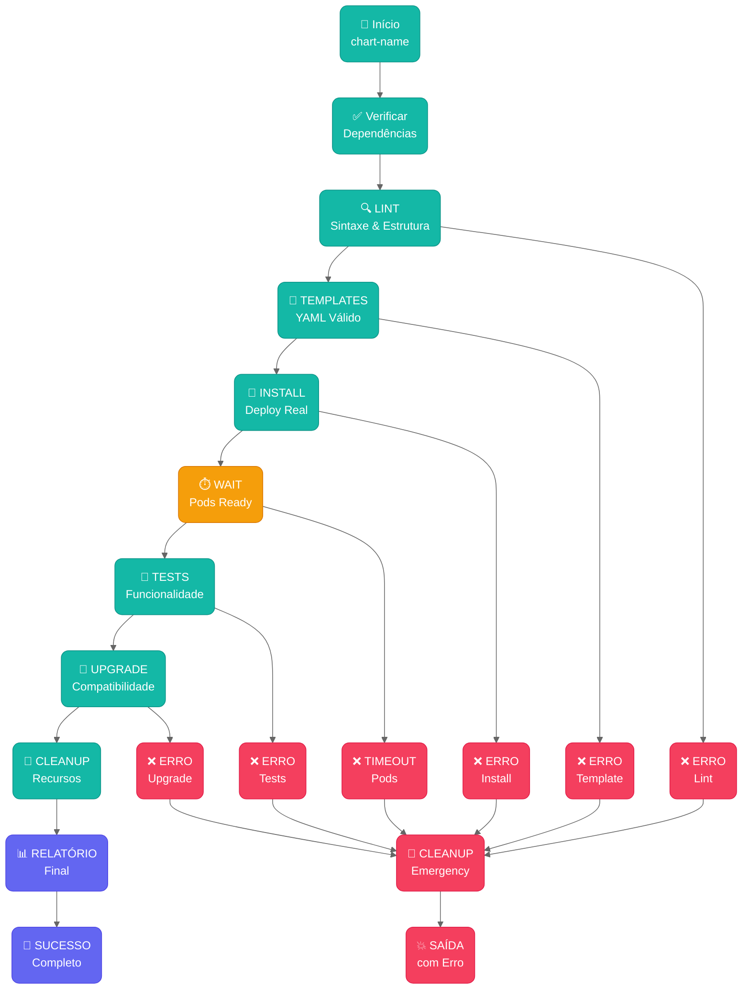

# 🧪 **Script de Teste de Charts**

> **Testa qualquer chart em 5 minutos** - simples, rápido e funcional!

---

## 🚀 **Uso Imediato**

```bash
# Testar qualquer chart
./scripts/test-chart/test-chart.sh bridge

# Teste rápido (apenas sintaxe)
./scripts/test-chart/test-chart.sh bridge --skip-install

# Charts que precisam de configurações específicas
./scripts/test-chart/test-chart.sh longhorn --set auth.password=minhasenha
```

---

## 🏗️ **Arquitetura de Testes**



---

## 📋 **O Que Testa**

### **🔍 5 Etapas Automáticas:**
1. **LINT** - Sintaxe básica (`helm lint`)
2. **TEMPLATES** - YAML válido (`helm template` + `kubectl dry-run`)
3. **INSTALL** - Deploy real (`helm install`)
4. **TESTS** - Funcionalidade (`helm test`)
5. **UPGRADE** - Compatibilidade (`helm upgrade`)

### **✅ Saída Típica:**
```bash
🧪 Testando chart: bridge
🔍 1/5 - Helm Lint... ✅
🔧 2/5 - Templates... ✅
🚀 3/5 - Install... ✅
🧪 4/5 - Tests... ✅
🔄 5/5 - Upgrade... ✅
🎉 Todos os testes passaram!
```

---

## ⚙️ **Opções Úteis**

| Comando | Quando Usar |
|---------|-------------|
| `bridge` | Teste completo (5 min) |
| `bridge --skip-install` | Apenas sintaxe (30 seg) |
| `longhorn --set auth.password=senha123` | Charts que precisam de configurações |
| `bridge --timeout 600` | Charts que demoram para subir |
| `bridge --cleanup-only` | Limpar recursos antigos |

---

## 🚨 **Troubleshooting**

### **❌ Problemas Comuns:**

#### **Chart não encontrado**
```bash
# ❌ Erro
./scripts/test-chart/test-chart.sh meuapp

# ✅ Solução - verificar charts disponíveis
ls charts/
# bridge/  minio/  redis/

./scripts/test-chart/test-chart.sh bridge
```

#### **Cluster não conecta**
```bash
# ✅ Verificar kubernetes
kubectl cluster-info
kubectl get nodes

# Se não funcionar, configurar context
kubectl config use-context meu-cluster
```

#### **Pods não sobem**
```bash
# ✅ Debug manual
kubectl get pods -n test-ns-*
kubectl describe pod -n test-ns-* 
kubectl logs -n test-ns-* deployment/test-*

# Ou aumentar timeout
./scripts/test-chart/test-chart.sh bridge --timeout 900
```

#### **Helm tests falham**
```bash
# ✅ Ver o que está falhando
kubectl logs -l app.kubernetes.io/component=test -n test-ns-*

# Ou pular testes temporariamente
./scripts/test-chart/test-chart.sh bridge --skip-tests
```

---

## 🔧 **Setup Inicial**

### **📋 Pré-requisitos (só uma vez):**
```bash
# 1. Helm instalado
brew install helm  # macOS
# ou baixar de https://helm.sh/docs/intro/install/

# 2. Kubectl configurado
kubectl cluster-info  # deve funcionar

# 3. Script executável (já está)
ls -la scripts/test-chart/test-chart.sh  # deve ter permissão x
```

### **🚀 Primeiro Teste:**
```bash
# Testar script
./scripts/test-chart/test-chart.sh --help

# Testar chart existente
./scripts/test-chart/test-chart.sh bridge
```

---

## 🤖 **CI/CD Integration**

### **GitHub Actions:**
```yaml
# .github/workflows/test-charts.yml
- name: Test All Charts
  run: |
    for chart in charts/*/; do
      chart_name=$(basename "$chart")
      ./scripts/test-chart/test-chart.sh "$chart_name" --timeout 600
    done
```

---

## 🎯 **RESUMO**

### **✅ O que faz:**
- **Testa sintaxe** com `helm lint`
- **Valida YAML** com `helm template`
- **Instala real** com `helm install`
- **Testa funcionalidade** com `helm test`
- **Verifica upgrade** com `helm upgrade`
- **Limpa tudo** automaticamente

### **🚀 Quando usar:**
- **Antes de commit** - Verificar se chart funciona
- **CI/CD** - Validação automatizada
- **Debug** - Identificar problemas rapidamente

### **⏱️ Tempo típico:**
- **Teste rápido**: 30 segundos (apenas sintaxe)
- **Teste completo**: 3-5 minutos (com deploy)

---

**💡 Um comando, cinco validações, zero configuração - teste qualquer chart em minutos!** 